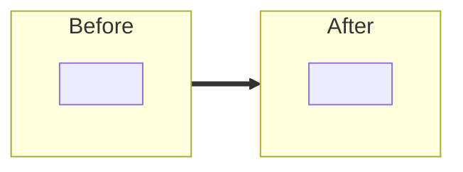

<!--
시니어가 빠르게 읽도록 작성한다.

원칙
- 자명한 변경(린터, 포맷, 단순 rename)은 적지 않는다.
- "무엇을 했다"가 아니라 "왜 그렇게 했고, 다른 길은 무엇이었나"를 적는다.
- 구조나 흐름이 핵심인 부분은 본문보다 mermaid 한 장이 빠르다. 자명한 변경엔 다이어그램을 만들지 않는다.
- 빈 섹션은 지운다. 없으면 없는 게 낫다.
-->

## TL;DR
<!-- 한두 줄. 변경의 목적과 결과만. -->

## 구조 변경
<!--
변경의 형태(전 → 후, 클래스 관계, 호출 흐름)가 글보다 그림이 빠를 때만.
간단한 버그 수정·문구 변경엔 섹션 통째 삭제. 본문 비교 표가 필요하면 다이어그램 아래에 짧게 둔다.
-->

## 핵심 변경
<!--
어디를 어떻게 바꿨는지 파일/타입 단위로 1줄씩.
형식: `path/Type.kt` — 한 줄 요약 (전 → 후)
-->

- `` — 

## 결정과 대안
<!--
고민이 필요했던 결정만. 결정 1개 = subsection 1개. 자명한 건 빼고 핵심 3~5개.
각 subsection 구성: (1) 문제·갈림길 짧은 산문, (2) 검토한 대안 중 구조가 핵심이면 mermaid, (3) 선택과 사유.
표는 쓰지 않는다 — 칸에 끼워 넣다 보면 결정의 무게가 평탄화된다.
-->

### 1. <결정 주제> — <선택>

<문제와 갈림길을 한두 단락으로>

<!-- 대안 비교/클래스 관계/모듈 경계 등이 글보다 빠르면 mermaid -->

- 검토한 대안: A / B / C
- 선택 이유: ...

## 트레이드오프
<!--
의식적으로 받아들인 비용. "왜 그래도 괜찮은가"를 한 줄로 덧붙인다.
없으면 섹션 통째 삭제.
-->

- 

## 리뷰 포인트
<!--
시니어가 어디부터 보면 되는지 1~3개. 의심스러운 코드, 관용에서 벗어난 곳을 먼저 적는다.
없으면 섹션 통째 삭제.
-->

- 

## 검증
- `./gradlew ktlintCheck`: 
- `./gradlew test`: 
- 추가/수정한 테스트(단위/통합/E2E):

## 후속
<!-- 이번 범위 밖이지만 인지하고 미룬 것. 없으면 섹션 통째 삭제. -->

- 
