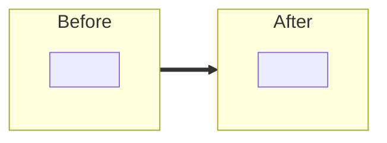

<!--
시니어가 빠르게 읽고 사고를 막도록 작성한다.

원칙
- 자명한 변경(린터, 포맷, 단순 rename)은 적지 않는다. diff 가 말해주는 것을 반복하지 않는다.
- "무엇을 했다"가 아니라 "왜 그렇게 했고, 다른 길은 무엇이었나"를 적는다.
- 구조나 흐름이 핵심인 부분은 본문보다 mermaid 한 장이 빠르다. 자명한 변경엔 다이어그램을 만들지 않는다.
- 빈 섹션은 지운다. 없으면 없는 게 낫다.
- 섹션 제목은 create-pr 스킬이 만드는 pr.md 와 1:1로 일치한다 (사람이 쓰든 AI 가 쓰든 같은 뼈대).
-->

# title
<!-- # <prefix>: <한 줄 요약 (한국어, 마침표 없이, 70자 이내)>  prefix ∈ feat/fix/refactor/migration/docs/chore/skills -->

## 배경
<!-- 왜 이 작업을 하는가. 한두 줄. 관련 설계 문서·이슈·요구사항(quest) 링크를 건다. 없으면 삭제. -->

## TL;DR
<!-- 한두 줄. 변경의 목적과 결과만. -->

## 구조 변경
<!--
(Optional) 컴포넌트/계층 관계나 호출 흐름이 바뀌고, 그게 글보다 그림으로 빠를 때만.
단순 버그 수정·문구 변경·파일 1~2개 변경엔 섹션 통째 삭제.
-->

## 핵심 변경
<!--
어디를 어떻게 바꿨는지 파일/타입 단위로 1줄씩. diff 요약이지 복붙이 아니다.
형식: `path/Type.kt` — 한 줄 요약 (전 → 후). 논리 묶음이 많으면 묶음 제목으로 그룹핑.
-->

- `` — 

## 결정과 대안
<!--
고민이 필요했던 결정만. 결정 1개 = subsection 1개. 자명한 건 빼고 핵심 3~5개.
각 subsection: (1) 문제·갈림길 짧은 산문, (2) 검토한 대안의 장단, (3) 선택과 결정적 사유.
표는 쓰지 않는다 — 칸에 끼워 넣다 보면 결정의 무게가 평탄화된다. 구조가 핵심이면 mermaid.
-->

### 1. <결정 주제> — <선택>

<문제와 갈림길을 한두 단락으로>

- 검토한 대안: A(장단) / B(장단) / C(장단)
- 선택 이유: <결정적 근거>

## 트레이드오프
<!--
한 결정에 묶이지 않는 *전역적*으로 받아들인 비용만 여기 모은다(예: 파일 수 증가, stereotype 누출).
특정 결정에 종속된 비용은 그 결정의 "결정과 대안" subsection 안에서 다룬다(중복 금지). 없으면 섹션 통째 삭제.
-->

- 

## 위험 요인
<!--
리뷰어가 *머지/배포되는 순간* 터질 수 있는 것. 나중에 갚을 부채는 여기가 아니라 "후속" 으로.
해당 없으면 "해당 없음" 한 줄, 섹션은 남긴다(의식적으로 확인했다는 신호).
위험이 있으면 신호만 적지 말고 *대응*(배포 순서/롤백/플래그/버전 병행)을 같이 적는다.
-->

- **DB 스키마/데이터 변경**: 있음 / 없음 — 있으면 마이그레이션 전략·롤백 가능성
- **파괴적 변경(API/계약)**: 있음 / 없음 — 있으면 소비자 영향·버저닝·배포 순서
- **동시성·데이터 정합성**: 동시 요청/경합에서 깨질 수 있는 지점과 그 처리(또는 미처리로 남긴 이유)
- **배포/복구**: 특별한 배포 순서·롤백 절차가 필요하면 명시 (없으면 생략)

## 리뷰 포인트
<!--
사람 리뷰어용. 시니어가 어디부터 보면 되는지 1~3개. 의심스러운 코드, 관용에서 벗어난 곳을 먼저 적는다. 없으면 섹션 통째 삭제.
주의: GitHub Copilot 자동 리뷰는 PR 본문을 읽는다는 보장이 없다. Copilot 규칙은
`.github/copilot-instructions.md` 또는 `.github/instructions/*.instructions.md` 에 인코딩한다.
-->

- 

## 검증
<!--
게이트 통과는 전제다. 핵심은 "무엇을 어떻게 확인했나".
증거(로그/수치/JSON)는 *실제 실행 결과*만 붙인다 — 추정·생성한 값을 적지 않는다(작성자가 직접 확인).
-->

- `./gradlew ktlintCheck`: 
- `./gradlew test`: 
- 추가/수정한 테스트(단위/통합/E2E): 
- 증거(필요 시, 작성자 확인): 실패·경계 시나리오 로그 / API 응답 JSON / 측정 수치

## 후속
<!-- 이번 범위 밖이지만 인지하고 미룬 것(알려진 공백)과 다음 작업. 없으면 섹션 통째 삭제. -->

- 
