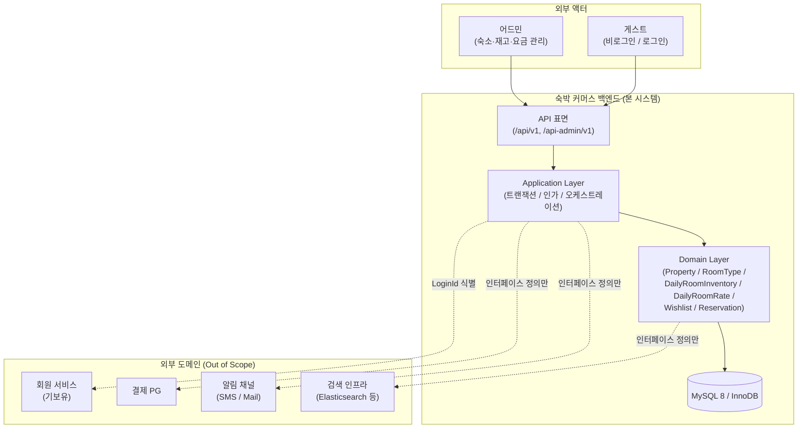
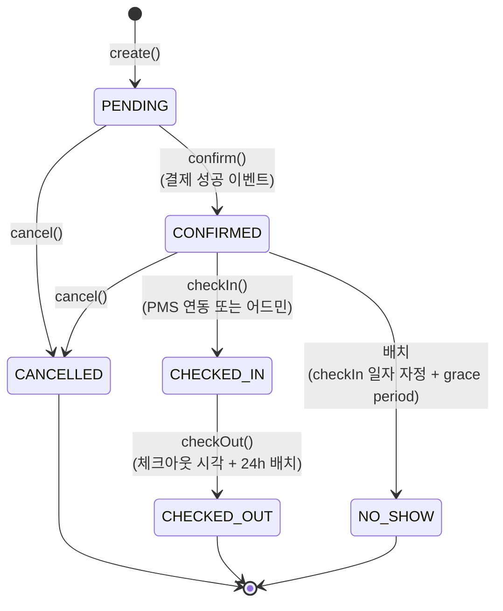

# 01 — 요구사항 정의

> 기준 시점: 2026-05-25
>
> **연관 문서**:
> - `00-ubiquitous-language.md` — **단일 어휘 사전** (도메인 / 아키텍처 / 상태 / 시스템 용어). 본 문서의 모든 용어가 따른다
> - `02-sequence-diagrams.md` — 핵심 흐름의 객체 협력
> - `03-class-diagram.md` — Aggregate / VO / 도메인 서비스 구조
> - `04-erd.md` — 영속성 구조
> - `05-domain-landscape.md` — 도메인 landscape / 산업 레퍼런스 / 모델 가드 / 도입 로드맵
>
> **문서 구조**:
> 1. **Context & Scope** (§0 ~ §2) — 시스템 컨텍스트 / In·Out of Scope / 가정
> 2. **Actors & Scenarios** (§3 ~ §5) — 도메인 어휘 / 액터·책임 / 유저 시나리오
> 3. **Specs & Policies** (§6 ~ §9) — 인수 기준 / 기능 명세 / 정책 / 예외 카탈로그
> 4. **API & NFR** (§10 ~ §11) — API 표면 / 비기능 요구사항
> 5. **Deferred Backlog** (§12) — 본 단계 외 항목과 도입 트리거

---

## §0 시스템 컨텍스트

본 문서는 **숙박 커머스 백엔드 단일 서비스** 의 도메인 설계를 다룬다. 결제·알림·검색 인프라 같은 외부 시스템은 현 단계 스코프 외이며, 인터페이스 자리만 마련해 둔다.

**경계 결정.**
- 단일 서비스 / 단일 RDB. 동시성·결제·외부 연동 도입 시 BC 분리를 재검토한다.
- 회원 식별은 기존 회원 서비스의 `X-Loopers-LoginId` 헤더로 받는다 — 인증·세션은 별도, 본 시스템는 식별만 사용한다.
- 결제 / 알림은 인터페이스 자리만 두고 호출하지 않는다.

---

## §1 스코프 (In / Out)

### In Scope
- **Property** — 검색·상세·이미지 갤러리
- **RoomType** — 인원 정책·침대 구성
- **DailyRoomInventory** — `(roomTypeId, date)` 단위 재고
- **DailyRoomRate** — `(roomTypeId, date)` 단위 요금
- **Wishlist** — 숙소 단위 멱등 토글
- **Reservation** — 상태 머신 정의 + `PENDING` 생성 + 일자별 재고 차감 + 요금 합산 + 취소 시 재고 복원

### Out of Scope

| 항목 | 이유 |
|---|---|
| 회원 (가입·로그인·인증) | 기존 회원 서비스 보유 — 본 시스템는 식별자만 사용 |
| 결제 / 환불 / 위약금 | 결제 도메인 미도입 — 취소 시 환불 흐름도 자동 제외 |
| 쿠폰 / 프로모션 | 별도 도메인 |
| 동시성 / 더블부킹 방지 / 락 / 트랜잭션 격리 수준 | 도메인 모델을 먼저 안정화한 뒤 동시성 단계에서 결정 |
| 쿼리 성능 / 인덱스 튜닝 / 캐시 | 운영 데이터 기반 측정 후 도입 |
| 알림 (찜 / 가격 / 예약 SMS·메일) | 외부 채널 미연동 |
| Idempotency-Key 강제 | 결제 도메인 도입 시점에 같이 도입 |

---

## §2 전제 가정 (Assumptions)

| 항목 | 가정 |
|---|---|
| **시간대** | 모든 일자(`checkIn` / `checkOut` / `date`) 는 KST(`Asia/Seoul`) 기준 `LocalDate`. "그날 하루" 의미. 글로벌 확장 시 재검토 |
| **체크인 시각** | 일자만 다루며 시각(15:00 등) 은 Out of Scope. 호텔 표준의 "체크아웃 당일은 다른 손님이 입실 가능" 정책을 §8.3 으로 단순화 |
| **일자 길이** | `checkOut − checkIn ≥ 1` (1박 이상). 0박 / 당일치기는 예약 거부 |
| **유저 식별** | 도메인·API 레이어는 `LoginId`(문자열 비즈니스 식별자) 로 유저 식별. `users.id` (BIGINT) 는 영속성 인공 키 |
| **API 멱등성** | 검색·조회 자연 멱등. 찜 등록/취소 **멱등**. **예약 생성 비멱등** — `Idempotency-Key` 미강제 |
| **데이터량 가정** | Property ≤ 1k, RoomType ≤ 5k, DailyRow ≤ 5k × 365 ≈ 1.8M / 년 |
| **응답 SLA (목표)** | **트래픽 기준 100 RPS 가정** — 검색 P95 < 1s, 단건 조회 P95 < 200ms. RPS 가 정량 검증되기 전까지는 SLA 가 아닌 설계 목표. 인프라·캐시 도입 시 재설정 |
| **페이징 한계** | 모든 목록 API 는 `size ≤ 50` 강제 (`default 20`). 초과 시 400 — DB 부하 / app OOM 회피. 어드민 대량 export 는 별도 채널 (cursor 기반 / 비동기 잡) 로 분리 |
| **Rate limit** | 검색 / 조회: 분당 60 (IP / 사용자별), 예약 생성·취소: 분당 5 (사용자별). 게이트웨이 / Redis token bucket. 봇·스크립트 트래픽 방어 |
| **보안** | 인증 / 인가는 외부 시스템 책임. 본인 자원 검증은 Application Layer 에서 `X-Loopers-LoginId` ↔ 자원 소유자 비교로 한정 |
| **동시성** | WAS 환경에서 단일 스레드는 성립하지 않는다. **재고 차감 흐름은 MVP 시점부터 Atomic UPDATE + DB CHECK 제약**으로 더블부킹을 방어 (`05-domain-landscape.md §3.1`). 비관 락 / Hold + TTL / 분산 락 같은 고급 동시성 제어는 결제 도메인 도입 시 점진적으로. 도메인 모델은 그때 깨지지 않게 시그니처만 정렬 |

---

## §3 도메인 용어

> **`00-ubiquitous-language.md` 가 단일 출처**. 본 문서에서 사용하는 모든 도메인 / 아키텍처 / 상태 / 시스템 어휘는 00 의 정의를 따른다. 새 용어 도입 / 기존 의미 변경은 00 부터 갱신.

---

## §4 액터 / 책임

| 액터 | 권한 / 책임 | 식별 |
|---|---|---|
| 게스트 (비로그인) | 검색 / 상세 조회 / 객실 목록 조회 | 헤더 없음 |
| 게스트 (로그인) | 위 + 찜 / 본인 예약 생성·조회·취소 | `X-Loopers-LoginId` |
| 어드민 | Property / RoomType / Inventory / Rate CRUD, 예약 전체 조회 | 어드민 인가는 외부 콘솔·게이트웨이 책임 가정 (도메인은 식별만) |
| 시스템 (배치) | `NO_SHOW` 전이 등 시간 기반 전이 | 결제 도메인 도입 단계의 배치에서 트리거 |

---

## §5 유저 시나리오

### 시나리오 A — 비로그인 검색 → 상세 조회
1. 게스트가 도시(`seoul`) · 체크인(`2026-05-10`) · 체크아웃(`2026-05-12`) · 인원(`2`) 으로 숙소 검색
2. 결과 리스트에 **검색 기간 합산 가격** · 1박 평균 가격 · 누적 찜 수 · 평점 표시
3. 정렬 변경 (`recommended` → `price_asc`) *(MVP 는 `recommended` 만 P0, 나머지는 §10 의 P1)*
4. 숙소 클릭 → 객실 타입 목록 + 가용 여부 + 기간 합산 가격
5. 객실 타입 상세에서 일자별 요금 / 정책 확인

### 시나리오 B — 로그인 후 찜
1. 로그인 게스트가 숙소 상세에서 **찜 등록** (`POST /api/v1/properties/{id}/wishes`)
2. 같은 버튼 재클릭 → **찜 취소** (`DELETE`) — 멱등
3. `GET /api/v1/users/{loginId}/wishes` 로 본인 찜 목록 조회
4. 숙소의 누적 찜 수가 검색 / 상세 응답에 반영

### 시나리오 C — 예약 생성
1. 로그인 게스트가 객실 타입 + 체크인 / 체크아웃 + 인원 + 게스트 정보로 예약 요청
2. 인원 수가 객실 최대 인원 이내인지 검증
3. 체크인 ~ (체크아웃 − 1) 모든 일자의 재고가 1 이상인지 확인 후 1씩 차감
4. 같은 일자들의 요금 합산 → 총 결제 금액
5. 예약을 `PENDING` 으로 저장 — 결제 도메인 도입 후 `CONFIRMED` 전이

### 시나리오 D — 예약 취소
1. 본인 예약인지 검증 (`X-Loopers-LoginId` ↔ `reservation.userId`)
2. 상태가 취소 가능(`PENDING` / `CONFIRMED`)인지 검증
3. 일자별 재고 1씩 복원
4. 상태를 `CANCELLED` 로 전이 (`cancelledAt` 기록)
5. *(스코프 외)* 환불 / 위약금 — 결제 도메인 도입 후

---

## §6 인수 기준 (Acceptance Criteria)

> 단위 / 통합 테스트의 `@DisplayName` 으로 그대로 옮길 수 있어야 한다.

| ID | Given | When | Then |
|---|---|---|---|
| AC-1 | 도시 `seoul`, 체크인 `2026-05-10`, 체크아웃 `2026-05-12`, 인원 `2` | `GET /api/v1/properties/search` | 각 숙소는 가용 RoomType 의 **2박 요금 합** 중 최저가를 `totalPrice` 로, `avgPerNight = totalPrice / 2` |
| AC-2 | 검색 기간 중 **하루라도** 재고 0 인 RoomType 만 보유한 숙소 `P` | 검색 호출 | `P` 는 결과에서 **제외** |
| AC-3 | RoomType 5520, 5/10 ~ 5/12 의 `total=10, reserved=0` | 5/10 ~ 5/12 예약 1건 생성 | 5/10 / 5/11 의 `reserved=1`, **5/12 의 `reserved=0`** (변화 없음) |
| AC-4 | 5/10 가용, 5/11 가용 0 | 5/10 ~ 5/12 예약 시도 | 409 Conflict, **5/10 의 reserved 도 원상복구** (트랜잭션 롤백) |
| AC-5 | `RoomType.maxGuests = 2` | `guestCount = 3` 으로 예약 시도 | 400 Bad Request, **재고 차감 발생 X** |
| AC-6 | 게스트가 숙소 P 에 미찜 상태 | `POST /wishes` 를 2회 호출 | Wishlist 행 1개, `property.wish_count` 증가 1회만 (멱등) |
| AC-7 | 게스트 A 가 게스트 B 의 예약 ID 를 안다 | `X-Loopers-LoginId: A` 로 B 의 예약 조회 / 취소 | 403 Forbidden — Application Layer 의 자원 소유자 검증 |
| AC-8 | 예약 상태 `CHECKED_IN` 이상 | 취소 시도 | 409 Conflict — 상태 머신 위반 (`canTransitTo`) |
| AC-9 | 인벤토리 행 자체가 누락된 일자 | 예약 시도 | 409 Conflict — "가용 0" 과 동일 처리 |
| AC-10 | RoomType 의 소속 Property ≠ 요청 `propertyId` | 예약 시도 | 400 Bad Request — 잘못된 조합 차단 |

---

## §7 기능 요구사항 (도메인별)

### 7.1 Property (숙소)

**대고객 기능**
- 도시 + 체크인 / 체크아웃 + 인원 + 정렬 + 페이징으로 검색
  - 결과는 가용 객실 타입이 1개 이상인 숙소로 한정
  - 응답 필드: 검색 기간 합산 요금 + 1박 평균 요금 + 누적 찜 수 + 평점
- 숙소 상세 (위치·편의시설·정책·카테고리·설명·대표이미지·평점·찜 수)

**어드민 기능**
- 목록 / 상세 / 등록 / 수정 / 비활성 (status = INACTIVE / ARCHIVED). **Hard delete 금지** — 과거 예약·매출·찜 통계 정합성 보존
- INACTIVE 전환은 소속 RoomType 까지 동일 상태로 전이 (애플리케이션 레벨 트랜잭션)

**Property 속성**

| 속성 | 타입 | 비고 |
|---|---|---|
| `name` | 짧은 문자열 | 필수 |
| `category` | enum (`HOTEL` / `MOTEL` / `PENSION` / `RESORT` / `GUESTHOUSE`) | 필수, 검색 필터 후순위 |
| `description` | 긴 문자열 | 선택 |
| `address` | `city` + `fullAddress` + `(latitude, longitude)?` | `city` 필수, 좌표 후순위 |
| `amenities` | 태그 집합 (`{"WIFI", "POOL", "PARKING"}`) | 검색 필터 후순위 |
| `policy` | 체크인 / 체크아웃 시각 / 취소 정책 / 흡연 / 반려동물 | **본 시스템은 표시·스냅샷까지** — 정책 적용 로직 X |
| `mainImageUrl` | URL 문자열 | 검색 결과 응답에 join 회피 (캐시) |
| `images[]` | `(url, displayOrder, isMain)` × N | 상세 페이지 노출 |
| `starRating` | 1~5 정수, NULL 허용 | **공식 별 등급** — 검색 필터용 |
| `rating` | 0.00 ~ 5.00 | **사용자 평점** — 리뷰 도메인 도입 전까지 placeholder, `starRating` 과 의미 다름 |
| `wishCount` | int ≥ 0 | §7.5 참조 |

> `policy` VO 는 데이터 보유 + 응답 노출 + 예약 시 스냅샷 고정까지. **위약금 산정 같은 정책 적용은 결제 도메인 도입 후** — 현 단계에서 `policy.applyCancellation()` 같은 메서드를 미리 만들지 않는다.

> **현 단계에서 다루지 않는 호텔 정보**: 연락처, 사업자 정보, 부대시설, 주변 정보, 체인 / 브랜드, 운영시간, 사용 언어, 테마. 어드민·리뷰·검색 인프라 도입 시 추가 (도입 시점은 `05-domain-landscape.md §2.0`).

### 7.2 RoomType

- 숙소의 객실 타입 목록 (가용 여부 포함) / 상세 / 등록 / 수정 / 삭제
- **소속 숙소(`propertyId`) 는 등록 후 수정 불가** — 소속 변경은 비즈니스적 무의미
- 등록 시 기준 인원 / 최대 인원 / 침대 구성 필수

### 7.3 DailyRoomInventory

- `(roomTypeId, date)` 단위로 1행
- 어드민이 기간 단위로 일괄 등록 (`PUT /api-admin/v1/rooms/{id}/inventory`, `ranges[]`)
- **잔여 수량 음수 방지는 도메인 레벨** + DB CHECK 다중 방어
- 차감 / 복원 단위 = 1실
- 조회 단위 = `(roomTypeId, [from, to))`
- **Stop-sell (판매 중지)**: 재고가 남아있어도 어드민이 강제 차단해야 하는 경우 (보수·점검·임의 정책) — 본 시스템은 미구현. 도입 시 `(roomTypeId, date)` 키 위에 `is_sellable BOOLEAN` 또는 별도 `daily_rate_restrictions` 테이블로 확장 (`05-domain-landscape.md §2.2`)

### 7.4 DailyRoomRate

- `(roomTypeId, date)` 단위 (재고와 동일 키)
- 어드민이 기간 단위로 일괄 등록 (Inventory 와 동일 페이로드의 `pricePerNight` 필드)
- 합산은 도메인 서비스(`ReservationPriceCalculator`) 가 담당
- 비수기 / 성수기 변동은 동일 키로 표현 (날짜만 다름) — Rate Plan 분리는 후속 단계

### 7.5 Wishlist (찜)

- `(userId, propertyId)` 단위 1행
- 본인 찜 목록 조회 (`GET /api/v1/users/{loginId}/wishes` — 타 유저 접근 금지)
- **숙소 단위** (객실 단위 X) — 사용자는 일반적으로 "이 호텔 좋네" 라고 찜하지 특정 객실 타입을 찜하지 않음
- 누적 찜 수는 검색 / 상세 응답에 포함
- **등록 / 취소 멱등** (이미 존재하면 noop, 미존재 취소도 noop)

### 7.6 Reservation (예약)

**대고객**
- 생성 (객실 타입 + 체크인 / 체크아웃 + 인원 + 게스트 정보 — 이름 / 전화)
- 본인 예약 목록 (기간 필터 `startAt` / `endAt`)
- 본인 예약 단건 상세
- 본인 예약 취소

**어드민**
- 목록 / 단건 상세

**예약 시 도메인 보장**
- 체크인 ~ (체크아웃 − 1) 의 모든 일자에 대한 재고 차감 — **체크아웃 당일 X**
- 인원 수 ≤ 객실 최대 인원
- 더블부킹 방지 → 동시성 제어 도입 후 (본 시스템은 단일 스레드 가정)
- 예약 정보 = **스냅샷**. 당시의 숙소·객실·정책 정보가 예약에 고정 — 이후 원본이 바뀌어도 영수증은 변하지 않는다

---

## §8 정책 (Domain Policy)

### 8.1 검색 정렬

| 정렬 키 | 의미 | 우선순위 |
|---|---|---|
| `recommended` | 기본값. MVP 는 평점·찜 수 가중합의 단순 산식 (운영 정책 정의 후 정교화) | P0 |
| `price_asc` | 검색 기간 합산 요금 오름차순 | P1 |
| `rating_desc` | 평점 내림차순 | P1 |
| `wishes_desc` | 누적 찜 수 내림차순 | P1 |

### 8.2 인원 정책

- `baseGuests` (기준 인원) / `maxGuests` (최대 인원) 두 값을 객실 타입이 보유
- `guestCount > maxGuests` → 예약 거부 (400)
- `baseGuests` 초과 시 추가 요금 정책은 Out of Scope — 본 시스템은 `maxGuests` 검증만
- **성인 / 아동 분리는 Out of Scope**. 실무에서 호텔은 `adultCount` / `childCount` 를 분리하여 인원 추가 요금 / 엑스트라 베드 정책에 활용한다. 현 모델은 단일 `guestCount` 만 유지하되, 향후 분리 시 `GuestCount` VO 가 `adults: Int + children: Int` 로 확장될 수 있도록 인터페이스만 보존 (`03-class-diagram.md §4`)

### 8.3 일자별 차감 정책

- 체크인 ~ (체크아웃 − 1) 의 모든 일자에 대해 재고 1씩 차감
- 체크아웃 **당일은 차감 X** — 그날 밤은 다른 손님이 들어올 수 있음 (호텔 표준)
- 이 정책은 `StayPeriod.datesToReserve()` 한 곳에만 캡슐화 (양쪽 흐름 — 예약 / 취소 — 의 단일 진실 원천)

### 8.4 예약 상태 머신

**전이 트리거**:
- `PENDING → CANCELLED`: 사용자 명시적 취소 API 또는 결제 실패 보상 트랜잭션
- `PENDING → CONFIRMED`: 결제 도메인의 성공 이벤트 (Saga)
- `CONFIRMED → CHECKED_IN`: PMS / 프론트 데스크 연동 또는 어드민 수동
- `CHECKED_IN → CHECKED_OUT`: 체크아웃 시각 (`policy.checkOutTime` + 24h) 경과 시 배치 트리거 — 사용자가 명시적으로 누르는 흐름 X
- `CONFIRMED → NO_SHOW`: 체크인 일자 자정 + grace period 후 배치
- `CHECKED_IN` 이후의 cancel: 도메인 예외 (409). 환불은 결제 도메인의 별도 흐름

**현 단계 구현 전이**: `create() → PENDING`, `PENDING → CANCELLED` (전이 검증만).

**선반영 enum (`NO_SHOW` 등)**: 결제·체크인 트리거 도입 시 enum 마이그레이션 비용을 피하기 위한 가드. enum 값과 전이 규칙(`CONFIRMED → NO_SHOW`)만 도메인에 정의하고, 실제 트리거(배치·결제 이벤트)는 결제 도메인 도입 단계에서 연결한다.

---

## §9 예외 카탈로그

| 케이스 | HTTP | 처리 |
|---|---|---|
| 검색 시 `checkOut ≤ checkIn` | 400 | `StayPeriod` 생성자에서 차단 |
| 검색 시 도시 코드 미지원 | 400 | 화이트리스트 검증 실패 |
| 검색 시 `guests ≤ 0` | 400 | API 입력 검증 |
| 가용성 조회 시 일자별 재고 행 누락 | — | 가용 0 으로 간주 (재고 미등록 = 판매 불가) |
| 예약 시 `guestCount > maxGuests` | 400 | `RoomType.checkGuestCount` 도메인 예외, **재고 차감 전** |
| 예약 시 일자 중 1일이라도 재고 < 1 | 409 | `DailyRoomInventory.reserveOne` 의 `require` 실패. **이미 차감한 일자 복원은 트랜잭션 롤백** |
| 예약 시 일자별 재고 행 누락 | 409 | "가용 0" 과 동일 처리 |
| 예약 시 RoomType 의 소속 Property ≠ 요청 `propertyId` | 400 | 잘못된 조합 차단 |
| 예약 취소 시 `CHECKED_IN` 이상 상태 | 409 | 상태 머신 위반 (`canTransitTo`) |
| 본인 외 예약 / 찜 접근 | 403 | Application Layer 에서 `X-Loopers-LoginId` ↔ 자원 소유자 비교 |
| 존재하지 않는 자원 (Property / RoomType / Reservation) | 404 | Repository 조회 실패 |
| 더블부킹 (동시성) | — | 동시성 제어 도입 후 — 본 시스템은 단일 스레드 가정 |

---

## §10 API 표면 — 구현 우선순위 매트릭스

> 본 절은 **요구사항으로서의 우선순위 (P0/P1/P2)** 만 다룬다. 시퀀스·트랜잭션 흐름은 `02-sequence-diagrams.md`, 요청·응답 스키마 상세는 OpenAPI 명세 (`docs/presentation/main.md` 또는 별도 spec) 참조.

| 우선순위 | Method + URI | 비고 |
|---|---|---|
| P0 | `GET /api/v1/properties/search` | 검색 — 정렬 `recommended` 만 P0 |
| P0 | `GET /api/v1/properties/{id}` | 상세 |
| P0 | `GET /api/v1/properties/{id}/rooms` | 객실 타입 목록 |
| P0 | `POST /api/v1/properties/{id}/wishes` | 찜 등록 (멱등) |
| P0 | `DELETE /api/v1/properties/{id}/wishes` | 찜 취소 (멱등) |
| P0 | `POST /api/v1/reservations` | 예약 생성 (`PENDING`) |
| P0 | `POST /api/v1/reservations/{id}/cancel` | 예약 취소 |
| P0 | `GET /api/v1/reservations` | 본인 예약 목록 |
| P0 | `GET /api/v1/reservations/{id}` | 본인 예약 상세 |
| P1 | 어드민 CRUD (Property / RoomType / Inventory / Rate) | 도메인 모델 우선, 어드민 컨트롤러는 후순위 |
| P1 | 검색 정렬 옵션 (`price_asc` / `rating_desc` / `wishes_desc`) | 도메인 정렬 함수만 우선 |
| P2 | 평점 / 추천 가중합 | 리뷰 도메인 도입 전까지 placeholder |

---

## §11 비기능 요구사항 (NFR)

> **트래픽 가정**: 초기 도입 기준 *피크 100 RPS / 검색 60% / 예약 5% / 단건 조회 35%*. 데이터량 가정은 §2 참조. SLA 는 본 트래픽·데이터량 가정 위에서 정의되며, 가정 변경 시 재설정 대상.

| 항목 | 목표 | 측정 시점 |
|---|---|---|
| 검색 응답 P95 | < 1s | MVP 한계 인정 — 인프라·캐시 도입 시 재설정 |
| 단건 조회 P95 | < 200ms | 현 단계 |
| 가용성 | 단일 인스턴스 가정 | 다중 인스턴스 도입 후 SLO 정의 |
| 데이터 정합성 | 단일 트랜잭션 내 일관성 (재고 차감 ↔ 예약 저장) | 현 단계 |
| 보안 — 자원 소유 검증 | 본인 자원 접근만 허용 (403 차단) | 현 단계 |
| 보안 — 인증 / 세션 / JWT | 외부 게이트웨이 책임 — 본 시스템은 헤더 식별만 |
| 관측성 — 로깅 / 트레이싱 | 기본 액세스 로그까지 | 운영 정책 결정 후 |

---

## §12 Deferred Backlog

> 현 단계에서 의도적으로 제외한 항목과 도입 트리거. 구현 중 의사결정 흔들림을 줄이기 위한 단일 출처. 상세 로드맵은 `05-domain-landscape.md` 참조.

| 항목 | 도입 트리거 |
|---|---|
| 더블부킹 방지 (Atomic UPDATE / 락 / UNIQUE 제약) | 동시성 제어 단계 — 도메인 모델 안정화 후 |
| 트랜잭션 격리 수준 / 분산 락 | 다중 인스턴스 / 분산 인프라 도입 |
| 결제 성공 → `CONFIRMED` 전이 / 보상 Saga | 결제 도메인 도입 |
| Reservation Hold + TTL | 결제 도메인 도입 |
| 환불 / 위약금 / `NO_SHOW` 배치 트리거 | 결제 도메인 도입 |
| Coupon 도메인 / 쿠폰 동시성 | 쿠폰 도메인 도입 |
| Outbox + 알림 (SMS / Email / Push) | 외부 채널 연동 |
| 리뷰 / 평점 비동기 재계산 | 리뷰 도메인 도입 (`CHECKED_OUT` 흐름 이후) |
| Rate Plan / LOS 제약 / Stop-sell | 다중 요금제 요구 발생 시 (현재는 단일 BAR) |
| 검색 N+1 / 일괄 조회 / 캐시 | 운영 데이터 기반 측정 후 |
| 검색 인프라 (Elasticsearch / 추천 정렬 / A/B) | 검색 인프라 도입 |
| OTA / Channel Manager | 별도 BC 신설 |
| 대실 / 시간 단위 예약 | `StayPeriod` 확장 결정 후 — 별도 VO 도입 |
| 다국적 / 다통화 (`Money.currency`) | 글로벌 확장 |
| Idempotency-Key 강제 | 결제 도메인 도입 |
| Soft delete / Audit log | 운영·컴플라이언스 정책 결정 후 |
