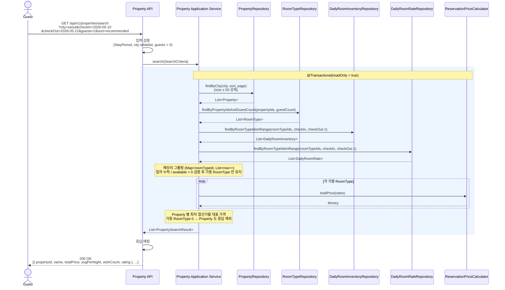
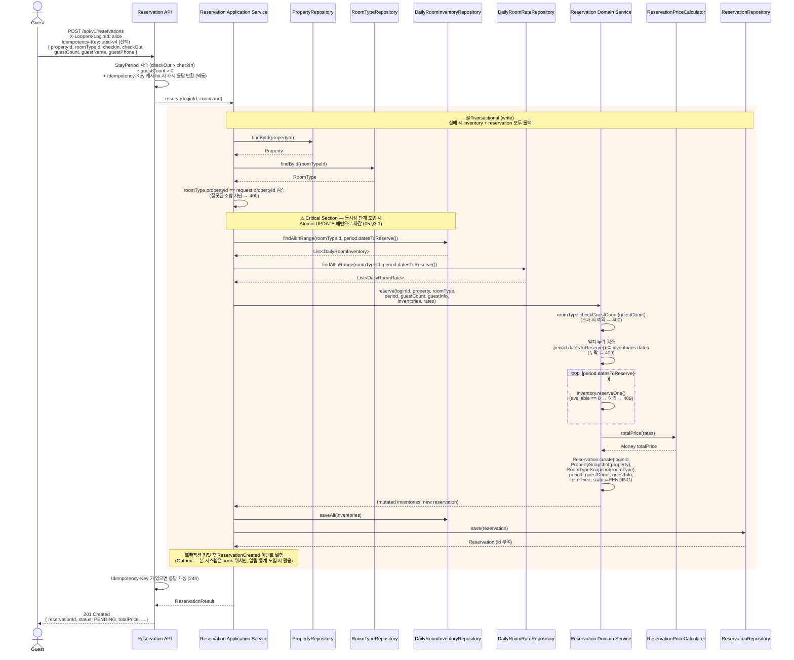
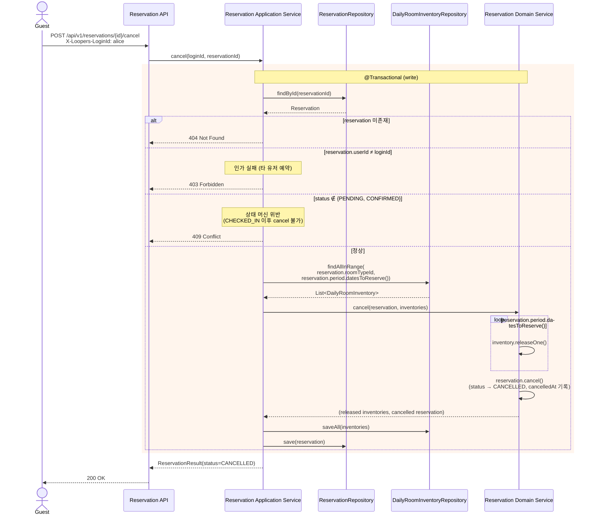
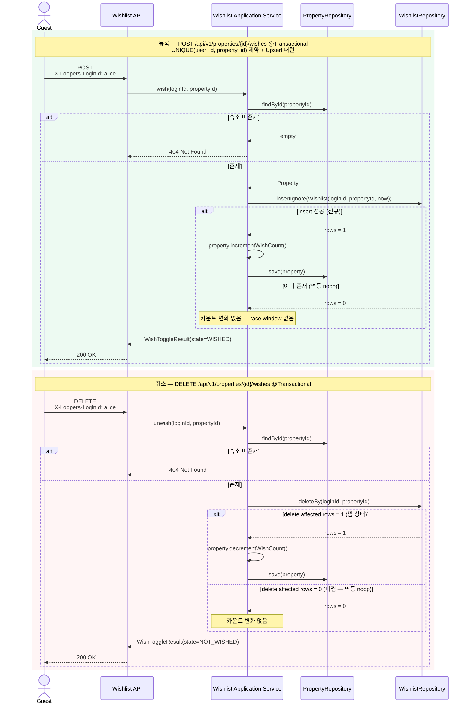

# 02 — 시퀀스 다이어그램

> **연관**: `00-ubiquitous-language.md` (단일 어휘 사전), `01-requirements.md` (§5 시나리오 / §9 예외), `03-class-diagram.md` (객체 구조 / 메서드 계약).
>
> **문서 구조**:
> 1. **Conventions** (§0 ~ §1) — 레이어 책임·호출 방향 / 시퀀스 표기 / 책임 분배 원칙
> 2. **시퀀스 (유스케이스별)** (§2 ~ §5) — 검색 / 예약 생성 / 예약 취소 / 찜 토글
> 3. **다이어그램으로 그리지 않는 것** (§6) — 시퀀스 분량이 무의미한 흐름
> 4. **Next Steps / Out of Scope** (§7) — 후속 단계 항목 통합 목록
>
> **02 의 책임 범위**: 레이어 간 트랜잭션 경계 / 오케스트레이션 / 예외 분기. 도메인 객체의 *invariant* 와 *상태 전이* 자체는 `03-class-diagram.md` 가 단일 출처.

---

## §0 레이어 책임 / 호출 방향

본 설계는 레이어드 아키텍처 + DIP 를 가정한다. 각 레이어의 책임:

| 레이어 | 책임 | 트랜잭션 |
|---|---|---|
| **API Layer** | 입력 형식 검증 (`StayPeriod`, 화이트리스트, `guests > 0`), 요청 ↔ 도메인 입력 변환, 응답 매핑 | 진입 전 / 응답 후 |
| **Application Layer** | **트랜잭션 경계** (`@Transactional`), 여러 도메인 객체 조립, **인가** (`X-Loopers-LoginId` ↔ 자원 소유자 비교), Repository 호출 흐름 제어 | 진입 ~ 응답까지 |
| **Domain Layer** | 비즈니스 규칙 (인원 검증, 일자별 차감, 요금 합산, 상태 전이). **Repository 직접 호출 지양 — 인자로 받는다** | 호출자가 보유 |
| **Persistence Layer** | Repository 구현. 도메인이 정의한 인터페이스의 어댑터 (DIP) | 트랜잭션 참여 |

**호출 방향**: `API → Application → Domain`. Persistence 는 Domain 인터페이스를 구현하며, Application 이 인터페이스를 의존한다 (DIP).

---

## §1 시퀀스 표기 규약 / 책임 분배 원칙

### 1.1 다이어그램 표기

| 표기 | 의미 |
|---|---|
| `->>` | 동기 호출 |
| `-->>` | 응답 |
| `rect rgba(...)` 영역 | 단일 트랜잭션 경계 |
| `alt / else` | 분기 |
| `loop` | 반복 (일자별 / Property 별) |
| `Note over X` | 보조 설명·결정 기록 |

### 1.2 책임 분배 원칙 (전 시퀀스 공통)

1. **Repository 호출은 Application Layer 가 모은다** — Domain Service 는 인자로 받은 객체로 협력만 한다. 단위 테스트가 in-memory 객체로 가능해진다.
2. **비즈니스 규칙은 도메인 메서드 안** — 음수 방지·인원 검증·요금 합산·상태 전이. **메서드 시그니처 / invariant / 사전·사후 조건의 단일 출처는 `03-class-diagram.md`** — 본 문서는 시퀀스 흐름에서 *어느 메서드를 호출하는지* 만 표시한다.
3. **인가는 Application Layer** — Domain 은 자기 데이터의 일관성만, 누가 호출했는지 모른다.
4. **Aggregate 간 참조는 ID 만** — 다른 Aggregate 의 객체가 필요하면 Application Layer 가 조립해서 넘긴다.
5. **CRUD 흐름 (`존재 검사 → 저장 / 삭제 → 카운트 갱신`) 은 Application Layer 직접 조립** — 도메인 서비스 미도입. 복잡한 협력만 도메인 서비스로 분리.
6. **상태가 바뀌는 트랜잭션 커밋 후** Domain Event 를 발행한다 — 알림·통계·OTA 동기·리뷰 재계산이 이 hook 에 붙는다 (본 시스템은 hook 위치만 지정).
7. **멱등 토글 (`존재 검사 → 변경`) 은 Check-Then-Act 회피** — DB UNIQUE 제약 + Upsert 패턴 (`ON DUPLICATE KEY UPDATE` 또는 `DataIntegrityViolationException` Catch) 으로 race window 제거.

### 1.3 동시성 가정

- WAS 환경에서 단일 스레드는 성립하지 않는다. **재고 차감 경로는 Atomic UPDATE + DB CHECK 제약** 으로 더블부킹을 방어 (`05-domain-landscape.md §3.1`). 본 문서의 시퀀스는 그 위에서 *오케스트레이션* 만 표현한다.
- 비관 락 / 낙관 락 / 분산 락 / 격리 수준 결정은 트래픽·EXPLAIN 측정 후. 본 문서는 락 패턴을 시퀀스에 그리지 않는다 — `05 §3` 참조.

---

## §2 시퀀스 1 — 숙소 검색

**유스케이스**: 비로그인 게스트가 도시 · 기간 · 인원으로 숙소를 검색.
**트랜잭션**: `@Transactional(readOnly = true)` — Application 진입 ~ 응답까지 단일 트랜잭션.
**SLA**: P95 < 1s (MVP 한계 인정 — 인프라 도입 시 재설정).

### 2.1 협력 흐름

### 2.2 책임 노트

- 입력 형식 검증 (`StayPeriod` / city whitelist / `guests > 0`) 은 **API Layer**.
- "어떻게 검색할지 / 어떤 RoomType 을 후보로 둘지" 의 흐름은 **Application Layer**.
- 가용성 판정 / 가격 합산 같은 비즈니스 규칙은 **Domain** 안에서만 (`PriceCalc`, `Inventory.available()`).
- 도메인 → API 응답 매핑은 API Layer — Application 은 도메인 노출 없는 결과 객체까지만 만든다.

### 2.3 의도된 단순화 / 재평가 트리거

| 항목 | 본 시스템 결정 | 재평가 트리거 |
|---|---|---|
| Repository 호출 | **IN 절 batch 조회** (`findByRoomTypeIdsInRange`) — Property → RoomType → Inventory / Rate 의 3-step batch | Property 행 ≥ 10k 또는 검색 P95 > 1s |
| 가용 RoomType 0 인 숙소 | 응답에서 제외 (사용자가 "예약 불가" 숙소를 볼 가치 없음) | 정책 변경 (예: "유사 일자 추천") 요구 발생 시 |
| `recommended` 가중 산식 | placeholder | 운영 데이터 (CTR / 전환율) 축적 후 |
| DB 타임아웃 | `Statement timeout = 3s`, 외부 IO 없음 | 검색 인프라 도입 시 Hedged Request / Fallback |

---

## §3 시퀀스 2 — 예약 생성

**유스케이스**: 로그인 게스트가 객실 타입 + 체크인 / 체크아웃 + 인원 + 게스트 정보로 예약 요청.
**트랜잭션**: `@Transactional` (write). 어느 한 일자라도 실패 시 **이미 차감한 inventory 까지 전체 롤백**.
**핵심 정책**: 체크아웃 당일 차감 X — `StayPeriod.datesToReserve()` 한 곳에 캡슐화.

### 3.1 협력 흐름

### 3.2 책임 분배 결정

- **Repository 호출은 Application Layer** — Domain Service 는 받은 객체로 협력만. 단위 테스트가 Repository 모킹 없이 in-memory 객체로 검증 가능.
- **재고 차감 / 인원 검증 / 요금 합산** 은 모두 도메인 안에서.
- **음수 방지**는 `inventory.reserveOne()` 의 `require` 가 자체 보장 — 호출자가 매번 검증할 필요 없음.
- **체크아웃 당일 제외**는 `StayPeriod.datesToReserve()` 한 곳에만 — 누락 발생 불가.
- **스냅샷**: `PropertySnapshot` / `RoomTypeSnapshot` 가 당시 이름·주소·정책을 고정 보유. 원본이 바뀌어도 예약은 영향받지 않는다.

### 3.3 예외 흐름

| 단계 | 실패 케이스 | HTTP | 롤백 |
|---|---|---|---|
| `StayPeriod` 생성 | `checkOut ≤ checkIn` | 400 | 트랜잭션 진입 전 |
| `findById` | Property / RoomType 없음 | 404 | — |
| 소속 검증 | `roomType.propertyId ≠ propertyId` | 400 | 차감 전 |
| `checkGuestCount` | `guestCount > maxGuests` | 400 | 차감 전 |
| 일자 누락 | inventory 행이 없는 일자 존재 | 409 | 차감 없음 |
| `reserveOne` | 어느 일자 `available == 0` | 409 | **이미 차감한 inventory 까지 트랜잭션 롤백** |
| 동시 예약 | 같은 inventory 에 동시 차감 | — | 동시성 단계에서 처리 |

---

## §4 시퀀스 3 — 예약 취소

**유스케이스**: 본인 예약을 취소. 인가 검증 + 재고 복원 + 상태 전이.
**트랜잭션**: `@Transactional` (write) — 인가 / 전이 / 복원 / 저장 단일 트랜잭션.

### 4.1 협력 흐름

### 4.2 책임 노트

- **인가는 Application Layer** — Domain 은 누가 호출했는지 모른다.
- 상태 전이 검증은 `Reservation.cancel()` 내부에서 `status.canTransitTo(CANCELLED)` 로 **다중 방어** — Application 에서 흘려보내도 도메인이 막아준다.
- **차감했던 일자만 복원**: 체크아웃 당일은 애초에 차감하지 않았으므로 `datesToReserve()` 가 그대로 복원 일자 리스트. 같은 VO 가 양쪽 흐름의 단일 진실 원천.

### 4.3 예외 흐름

| 단계 | 실패 케이스 | HTTP | 롤백 |
|---|---|---|---|
| `findById` | 예약 미존재 | 404 | — |
| 인가 | `reservation.userId ≠ loginId` | 403 | — |
| 상태 전이 | `CHECKED_IN` 이상 | 409 | — |
| `releaseOne` | invariant 위반 (예: 음수 진입) | 500 | 전체 트랜잭션 롤백 |
| 환불 / 위약금 | — | — | 결제 도메인 도입 단계의 보상 트랜잭션. 본 시퀀스는 재고 복원 + 상태 전이까지 |

---

## §5 시퀀스 4 — 찜 토글

**유스케이스**: 로그인 게스트가 숙소를 찜 / 취소. 멱등 처리.
**트랜잭션**: `@Transactional` — Wishlist 저장 + `Property.wishCount` 갱신 단일 트랜잭션.

### 5.1 협력 흐름

### 5.2 책임 노트

- "찜" 을 별도 도메인으로 분리한 이유 — `property.wishedUserIds++` 같은 모델은 확장성 X. `Wishlist(userId, propertyId, wishedAt)` 가 후속 기능(찜 알림 / 가격 변동 알림) 의 출발점.
- `Property.incrementWishCount` / `decrementWishCount` 가 정합성을 책임. `decrementWishCount` 는 도메인에서 `require(wishCount > 0)` 으로 음수 진입 차단 — DB CHECK 와 다중 방어. 멱등 처리에서 미찜 상태 unwish 호출 시 카운트가 음수로 떨어지면 데이터가 영구히 어긋난다.
- **Domain Service 미도입**: "존재 검사 → 저장 / 삭제 → 카운트 갱신" 은 Application Layer 가 직접 조립할 수 있는 단순 흐름. 도메인 서비스로 분리할 만한 협력 X.
- 멱등 처리로 같은 버튼 두 번 눌러도 카운트 어긋남 X.
- **동시 증감 정합성**은 동시성 단계에서 처리 (본 시스템은 단일 스레드 가정).

---

## §6 의도적으로 다이어그램으로 그리지 않는 것

| 흐름 | 이유 |
|---|---|
| 회원 가입 / 로그인 | 기존 회원 서비스 — 본 도메인 외 |
| 본인 예약 목록 / 단건 조회 (`GET /reservations`, `GET /reservations/{id}`) | 시퀀스 3 의 인가 흐름과 동일 (본인 검증 → 조회 → 매핑). 새로 그릴 가치 X |
| 결제 | 결제 도메인 도입 후 별도 다이어그램 |
| 검색 정렬 디테일 (`recommended` 가중 계산식) | placeholder. 운영 정책 정의 후 별도 다이어그램 |
| 동시성 / 락 / 재시도 | 동시성 단계에서 별도 다이어그램 |
| 어드민 CRUD (Property / RoomType / Inventory / Rate 등록·수정·삭제) | 일반 CRUD 패턴. 도메인 협력이 단순해 시퀀스로 그릴 가치 낮음 |

---

## §7 통합 Next Steps / Out of Scope

본 4개 시퀀스가 다루지 않은 후속 설계 항목을 한 곳에 모은다 — 각 시퀀스 하단에 분산하지 않고 본 섹션에서 일괄 추적한다.

| 영역 | 항목 | 도입 트리거 |
|---|---|---|
| 동시성 제어 | Atomic UPDATE / DB CHECK 제약 (MVP 부터 적용) | 도메인 모델 안정화 직후 |
| 동시성 제어 | 비관 락 / 낙관 락 / 분산 락 — 트래픽 측정 후 | 운영 트래픽 기반 |
| 트랜잭션 격리 | 격리 수준 결정 (`READ_COMMITTED` / `REPEATABLE_READ`) | 동시성 측정 결과 |
| 결제 Saga | PG Auth / Capture / Void, 보상 트랜잭션, `PENDING → CONFIRMED` | 결제 도메인 도입 |
| 환불 / 위약금 | `PropertyPolicy.cancellation` 적용, PG 환불 API | 결제 도메인 도입 |
| Idempotency-Key | 본문 캐싱·충돌 검출 흐름 | 결제 도메인 도입 |
| Hold + TTL | `Reservation.PENDING` 시간 제한 + 명시 release | 결제 도메인 도입 |
| Domain Event | Outbox + 메시지 브로커 + 알림 / 통계 / 리뷰 재계산 trigger | 알림 채널 연동 |
| OTA 동기 | Inbound (`OTA_HotelResNotifRQ`) / Outbound (`OTA_HotelInvCountNotifRQ`) | OTA 연동 BC 신설 |
| 검색 인프라 | Elasticsearch / Redis read model, geo / fulltext | 검색 인프라 도입 |
| 관측성 (Observability) | MDC 컨텍스트, 트레이스 ID, 비즈니스 지표 발행 | 관측 인프라 도입 |
