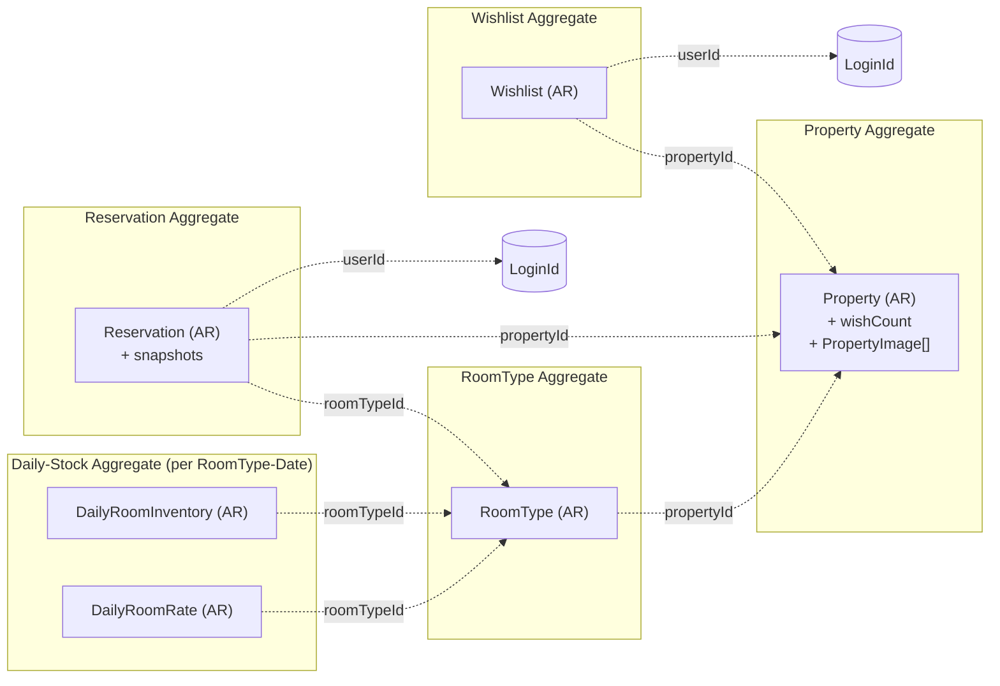
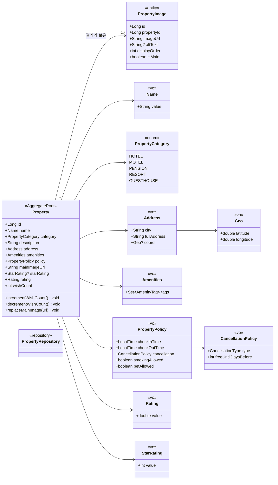
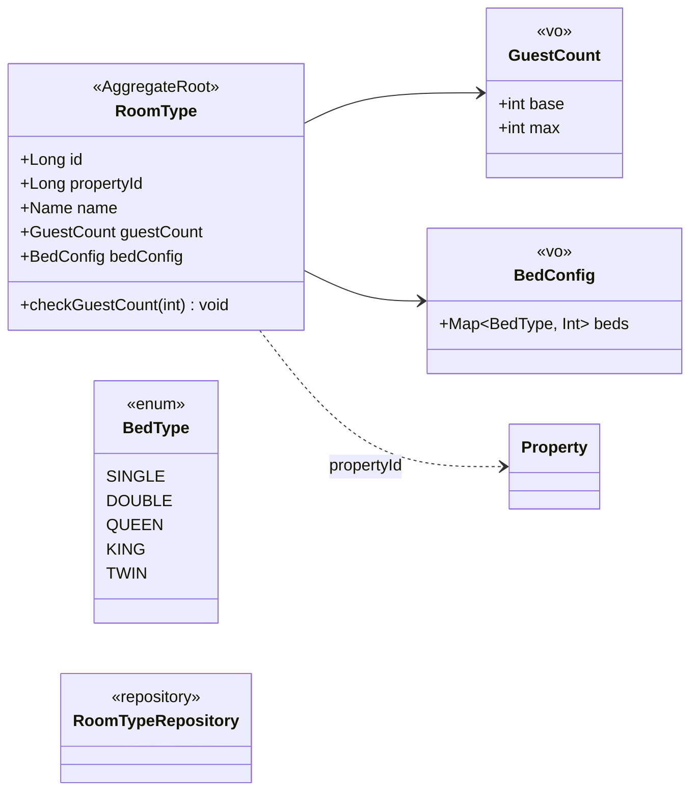
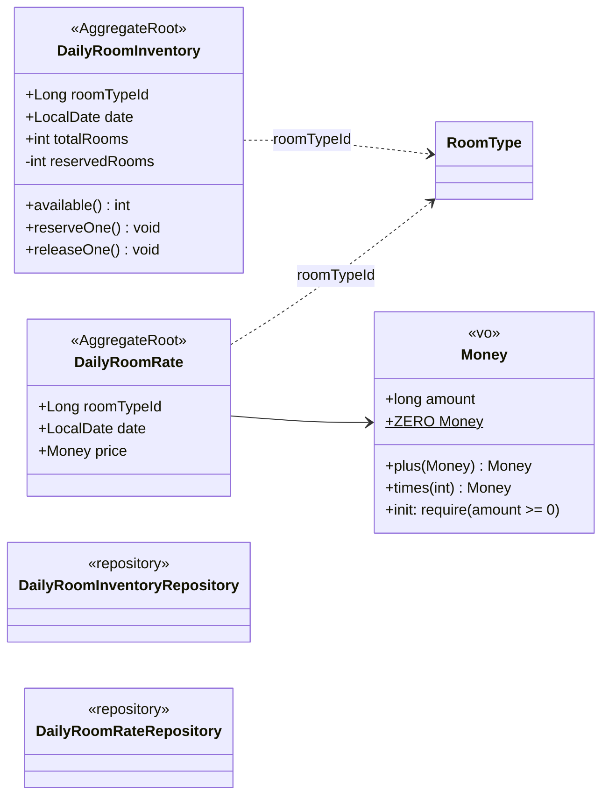
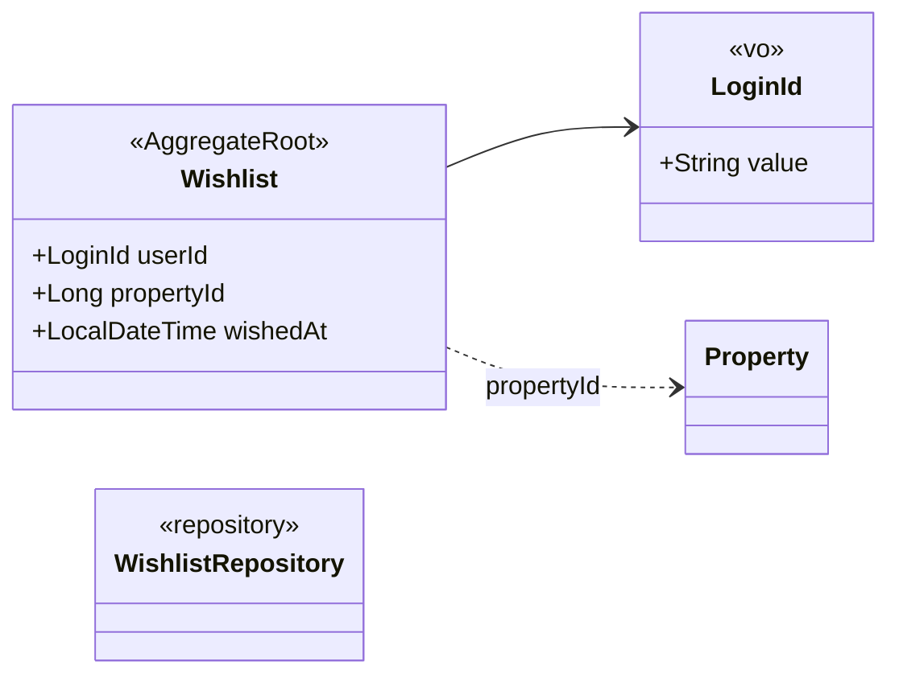
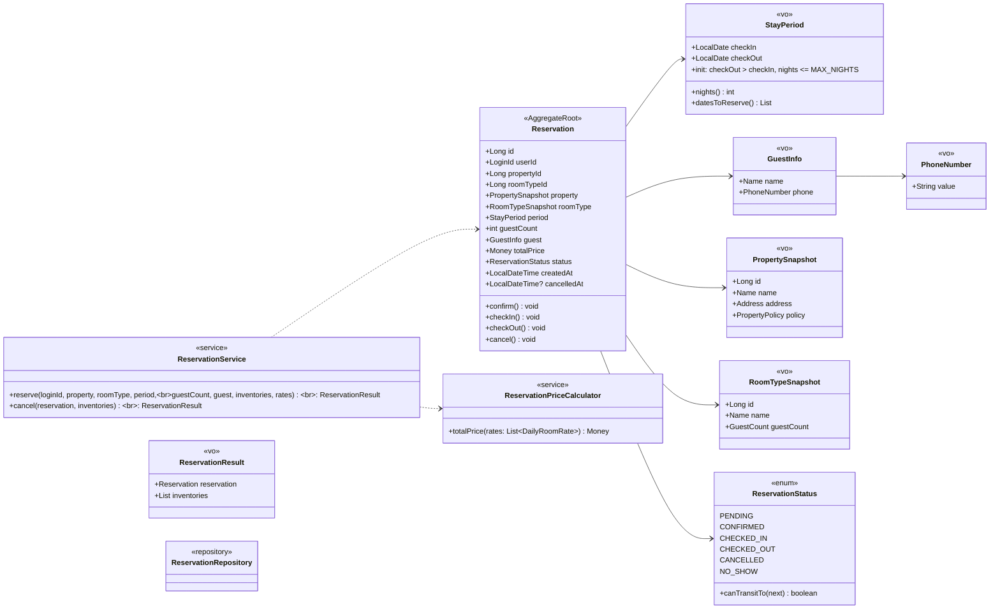

# 03 — 클래스 다이어그램 / 도메인 모델

> **연관**: `00-ubiquitous-language.md` (단일 어휘 사전), `01-requirements.md` (요구사항·AC), `02-sequence-diagrams.md` (협력 흐름·오케스트레이션), `04-erd.md` (영속성 / ORM 매핑 결정), `05-domain-landscape.md` (현 단계 외 도메인 / 모델 가드).
>
> **문서 구조**:
> 1. **Conventions** (§1 ~ §2) — Aggregate 경계 / 교차 참조·트랜잭션 규약
> 2. **Aggregate 상세** (§3 ~ §7) — 각 Aggregate 의 클래스·VO·메서드 계약·상태 머신
> 3. **Deferred & Boundary** (§8 ~ §10) — 도입하지 않을 도메인 서비스 / 의존 방향 / 의도된 예외 (다중 AR 트랜잭션)
>
> **03 의 책임 범위**: 도메인 객체 / VO / Aggregate / invariant / 상태 머신 / 메서드 계약. *오케스트레이션 흐름* 은 `02`, *영속성 결정 (ORM·인덱스·DDL)* 은 `04`.

---

## 표기 규약

> Mermaid 의 stereotype 은 공백 불가 — camelCase 단일 토큰을 쓴다.

| 표기 | 의미 |
|---|---|
| `<<AggregateRoot>>` | Aggregate 의 진입점. 외부는 AR 또는 동급 Repository 통해서만 내부 접근 |
| `<<entity>>` | 식별자 보유, 상태 변경 가능, 동일성 = ID |
| `<<vo>>` | 불변, 동일성 = 값 |
| `<<service>>` | 상태 없음. 도메인 객체들의 협력 조정 |
| `<<repository>>` | 도메인이 정의한 인터페이스 (구현은 인프라) |
| `→` (실선) | 합성 / 구성 (소유) |
| `..>` (점선) | 식별자 참조 / 의존만 |

---

## §1 Aggregate 경계

**결정**: 5 개 Aggregate / 6 개 AggregateRoot.

| Aggregate | AR | 자식 entity / VO |
|---|---|---|
| Property | `Property` | `PropertyImage` (entity) |
| RoomType | `RoomType` | — |
| Daily-Stock (per RoomType-Date) | `DailyRoomInventory`, `DailyRoomRate` | — |
| Wishlist | `Wishlist` | — |
| Reservation | `Reservation` | `PropertySnapshot` / `RoomTypeSnapshot` (VO) |

### 1.1 경계 결정 근거

**RoomType 을 Property 의 자식이 아닌 별도 AR**
- 라이프사이클 분리 — 어드민이 객실 타입 단독 추가 / 삭제. `room_types` 가 자체 PK.
- Property AR 안에 RoomType 컬렉션을 두면 검색·가용성 쿼리에서 항상 끌고 와야 함 (성능 압박).

**Inventory / Rate 가 같은 묶음이지만 각자 AR**
- `(roomTypeId, date)` 가 자연 키 — 트랜잭션 변경 단위가 행 단위.
- 변경 시점이 다르다 — 어드민 등록 시 같이 들어오지만, 차감 / 복원은 Inventory 만, 가격 조정은 Rate 만. 한 AR 로 묶으면 불필요한 동시 변경이 늘어남.

**Reservation 안의 Snapshot 은 Aggregate 참조가 아니다**
- `PropertySnapshot` / `RoomTypeSnapshot` 은 Property / RoomType 엔티티가 아닌 **VO**. Reservation Aggregate 안에 고정된 값. 원본이 바뀌어도 영수증은 불변.

---

## §2 교차 참조 / 트랜잭션 규약

| 규약 | 현 단계 적용 |
|---|---|
| Aggregate 간 참조 = **ID 만** (점선) | `RoomType.propertyId`, `Reservation.roomTypeId / propertyId / userId`, `Wishlist.userId / propertyId` |
| Aggregate 내부 객체끼리만 직접 참조 | `Property → PropertyImage`, `Reservation → StayPeriod / GuestInfo / Snapshots` |
| **트랜잭션 1개당 Aggregate 1개 변경 (이상 원칙)** | **본 시스템은 의도된 예외 채택**: 예약 흐름에서 `Reservation` + N개의 `DailyRoomInventory` 동시 변경 — 더블부킹 방지의 강한 일관성이 트랜잭션 단순화보다 우선. 대안 (Domain Event + Saga / Inventory AR 묶음 재설계) 의 트레이드오프는 §10 참조 |
| Domain Service 는 Repository 미의존 | 인자로 받은 도메인 객체로 협력만 — 예: `ReservationService.reserve(inventories, rates, ...)`. 단위 테스트 in-memory 객체로 가능 |
| 인가는 Application Layer | Domain 은 `userId` 의 의미를 모른다 |
| **Domain Event 발행 시점** | 트랜잭션 커밋 직후, Application Layer 가 발행 — 도메인 객체는 이벤트 페이로드만 생성. 본 시스템은 hook 위치만 정의 (Outbox 미도입). 트리거: `ReservationCreated`, `ReservationCancelled`, `WishToggled` |

---

## §3 Property Aggregate

### 3.1 메서드 계약

| 메서드 | 사전 조건 | 사후 조건 / 예외 |
|---|---|---|
| `incrementWishCount()` | — | `wishCount += 1` |
| `decrementWishCount()` | `wishCount > 0` | `wishCount -= 1` / 위반 시 도메인 예외 |
| `replaceMainImage(url)` | 갤러리에 해당 url 존재 | `is_main = TRUE` 행 정확히 1개, `mainImageUrl` 캐시 동기 갱신 |

### 3.2 결정

- `wishCount` 는 단순 `int` — VO 까지 두지 않는다 (한 값에 추가 행위 없음). 정합성은 같은 트랜잭션 내 increment / decrement 로.
- **`decrementWishCount` 의 `require(wishCount > 0)` 가 도메인 가드** — DB CHECK (`wish_count >= 0`) 와 다중 방어. 멱등 처리 시 음수로 떨어짐 차단.
- `PropertyPolicy` 는 **VO**. 본 시스템은 보유·노출·예약 시 스냅샷까지. **`applyCancellation()` 같은 메서드를 추가하지 않는다** — 정책 적용은 결제 도메인 도입 후.
- `Rating` 은 placeholder (리뷰 도메인 도입 시 비동기 재계산). `StarRating` 은 **공식 별 등급** — 의미가 다르므로 명확히 분리.
- `PropertyImage` 의 `is_main = TRUE` 행은 **0~1개** — 도메인 레벨 보장. `Property.replaceMainImage(url)` 가 갤러리 갱신 + 캐시 동기를 함께 수행.
- `mainImageUrl` 컬럼은 의도적 역정규화 — 검색 결과 응답에서 `property_images` join 회피용.

---

## §4 RoomType Aggregate

### 4.1 메서드 계약

| 메서드 | 사전 조건 | 사후 조건 / 예외 |
|---|---|---|
| `checkGuestCount(n)` | — | `n ≤ guestCount.max` 위반 시 도메인 예외 → 400 |

### 4.2 결정

- `propertyId` 는 등록 후 **불변** — 객실의 소속 숙소 변경은 비즈니스적 무의미.
- `GuestCount.base / max` 두 값 보유 — `base` 초과 시 추가 요금 정책은 Out of Scope.
- `BedConfig` 는 침대 타입별 수량 맵 — 표시·검수용. 검색 필터로 들어오면 generated column 검토.

---

## §5 Daily-Stock Aggregate

### 5.1 메서드 계약

| 메서드 | 사전 조건 | 사후 조건 / 예외 |
|---|---|---|
| `available()` | — | `totalRooms - reservedRooms` |
| `reserveOne()` | `available() > 0` | `reservedRooms += 1` / 위반 → 도메인 예외 → 409 |
| `releaseOne()` | `reservedRooms > 0` | `reservedRooms -= 1` / 위반 → invariant 위반 |

### 5.2 결정

- `reservedRooms` 는 **private** — 외부는 `available()` / `reserveOne()` / `releaseOne()` 만 호출. 음수 / 초과는 도메인 레벨에서 절대 발생 불가.
- 동일성: 자연 키 `(roomTypeId, date)`. **복합 PK 의 ORM 매핑 결정은 `04-erd.md §4.1`** 의 인프라 관심사 (도메인 모델 문서에서는 식별성만 명시).
- `Money` 는 KRW 원 단위 `long`. 합산 흐름은 `plus` 기본 — 일자별 `Rate` 모아 `plus` 로 합산. `times` 는 쿠폰 / 세금이 들어올 자리로 남겨두지만 현 단계 합산엔 미사용.
- **`Money` invariant**: 생성 시 `amount >= 0` 강제. `times(0)` 은 허용 (ZERO), `times(-1)` 같은 음수 곱셈 금지.
- **`Money.currency` 미보유** — 다국적은 글로벌 확장 시 도입. 지금 추가하면 모든 합산 흐름에 currency 검증이 매번 끼워져 비용만 늘어난다.

---

## §6 Wishlist Aggregate

### 6.1 결정

- 도메인 서비스 **미도입** — "존재 검사 → 저장 / 삭제 → 카운트 갱신" 은 한 줄 위임. Application Layer 가 직접 조립.
- 동일성: 자연 키 `(userId, propertyId)` — 같은 사용자가 같은 숙소를 두 번 찜할 수 없음 (멱등의 모델 표현).

---

## §7 Reservation Aggregate

가장 무거운 도메인 — **스냅샷 패턴** + **상태 머신** + **다른 Aggregate 와의 트랜잭션 협력**.

### 7.1 메서드 계약

| 메서드 | 사전 조건 | 사후 조건 / 예외 |
|---|---|---|
| `Reservation.create(...)` | period 유효, `guestCount ≤ maxGuests` | `status = PENDING`, `createdAt` 기록 |
| `Reservation.confirm()` | `status.canTransitTo(CONFIRMED)` | `status = CONFIRMED` |
| `Reservation.checkIn()` | `status.canTransitTo(CHECKED_IN)` | `status = CHECKED_IN` |
| `Reservation.checkOut()` | `status.canTransitTo(CHECKED_OUT)` | `status = CHECKED_OUT` |
| `Reservation.cancel()` | `status ∈ {PENDING, CONFIRMED}` | `status = CANCELLED`, `cancelledAt` 기록 / 위반 → 409. **재고 복원 책임은 호출자** (Application Layer) — 도메인은 상태 전이만 |
| `ReservationStatus.canTransitTo(next)` | — | 정의된 전이만 `true` |
| `StayPeriod(checkIn, checkOut)` | `checkOut > checkIn` 이고 `nights() <= MAX_NIGHTS` (기본 30) | 생성 / 위반 → 400. 어뷰징 / 실수 입력 차단 |
| `StayPeriod.datesToReserve()` | — | `[checkIn, checkOut)` 의 일자 리스트 (체크아웃 당일 X) |
| `StayPeriod.nights()` | — | `checkOut.toEpochDay() - checkIn.toEpochDay()` |
| `ReservationPriceCalculator.totalPrice(rates)` | rates 비어있지 않음, 모두 동일 `roomTypeId` | `rates.map(price).reduce(Money.plus)` |

### 7.2 상태 전이 매트릭스

| From \ To | PENDING | CONFIRMED | CHECKED_IN | CHECKED_OUT | CANCELLED | NO_SHOW |
|---|---|---|---|---|---|---|
| PENDING | — | ✅ | — | — | ✅ | — |
| CONFIRMED | — | — | ✅ | — | ✅ | ✅ |
| CHECKED_IN | — | — | — | ✅ | — | — |
| CHECKED_OUT | — | — | — | — | — | — |
| CANCELLED | — | — | — | — | — | — |
| NO_SHOW | — | — | — | — | — | — |

**현 단계 구현 전이**: `(외부) → PENDING`, `PENDING → CANCELLED`.
**선반영 enum (`NO_SHOW` 등) + 전이 규칙**: 트리거 시점의 enum 마이그레이션 회피용 가드. 실제 트리거(체크인 일자 자정 후 배치 등) 는 결제 도메인 도입 단계에서 연결.

### 7.3 결정

- **`ReservationService` 는 Repository 미의존** — 인자로 `inventories`, `rates` 받음. 시퀀스 2 / 시퀀스 3 의 책임 분배(Repository 호출은 Application Layer) 와 정합. 단위 테스트가 in-memory 객체로 가능.
- **`PropertyService` 미도입** — 검색은 Application Layer 가 Repository 들을 조립하면 충분. 도메인 규칙이 무거워지면 그때 도입.
- `Reservation.cancel()` 은 상태 전이만 수행 (`status.canTransitTo(CANCELLED)` 검증 + `cancelledAt` 기록). 재고 복원 / Domain Event 발행은 Application Layer 의 책임 — 도메인 단순성을 유지.
- **`roomTypeId` + `RoomTypeSnapshot` 동시 보유** — 스냅샷만 있으면 RoomType 이름 동일 시 식별 불가. 어드민 통계용 ("객실 타입별 예약 수").
- **`propertyId` 별도 보유** — `PropertySnapshot.id` 와 값은 같지만, 어드민이 "특정 숙소의 예약 목록" 을 JSON 스냅샷 키로 검색하지 않게 하기 위한 명시 컬럼.
- `cancelledAt` — 어드민 / CS 영역에서 취소 시점 필요.
- **Domain Event 트리거**: `ReservationCreated`, `ReservationCancelled`, `ReservationConfirmed` (결제 도메인 도입 시), `ReservationCheckedOut` (리뷰 도메인 도입 시). 발행은 Application Layer 가 트랜잭션 커밋 후 Outbox 에 기록 — 도메인 객체는 이벤트 페이로드만 노출 (`asCreatedEvent(): ReservationCreatedEvent` 등).

> **`StayPeriod` 모델링**: 두 개의 프로퍼티 (`checkIn`, `checkOut`) 를 가지므로 Kotlin `value class` 의 단일 프로퍼티 제약을 만족하지 못한다 — `data class` 로 모델링한다. ORM `@Embeddable` 매핑 결정은 `04-erd.md` 의 인프라 관심사.

---

## §8 도메인 서비스 — 만들지 않는 것

| 서비스 | 결정 | 이유 |
|---|---|---|
| `ReservationService` | **유지** | 인원 검증 + 일자별 차감 + 요금 합산의 협력. `Reservation` 단독으로 표현 불가 |
| `ReservationPriceCalculator` | **유지** | `List<DailyRoomRate>` 합산. 향후 쿠폰 / 세금이 모일 자리 |
| `WishlistService` | **삭제** | "존재 검사 → 저장 / 삭제 → 카운트 갱신" 은 한 줄 위임. Application Layer 가 직접 |
| `PropertyService` | **삭제** | 검색은 Application Layer 가 Repository 조립. 도메인 규칙이 생기면 그때 |
| `ReservationCanceler` 같은 한 줄짜리 | **미도입** | Application Layer 가 직접 Repository 호출 |

---

## §9 의존 방향 / 미루는 결정

**의존 방향**
- `domain ← infrastructure` : Repository 인터페이스는 도메인이 정의, JPA / MySQL 구현은 인프라 (DIP)
- `domain ← application` : Application Layer 가 도메인 객체를 끌어쓴다. 도메인은 application 패키지를 모른다 — `ReservationService.reserve` 는 `Command` 같은 application 객체를 받지 않고 풀린 인자를 받음
- 스냅샷은 양방향 의존이 아님 — `PropertySnapshot` 은 Property 와 별개의 VO

**Deferred — 모델에 미리 자리 잡지 않을 것** (전체 가드 / 로드맵은 `05-domain-landscape.md`)

| 항목 | 도입 트리거 |
|---|---|
| 동시성 락 (`@Version`, `SELECT FOR UPDATE`) | 트래픽 측정 후 — MVP 는 Atomic UPDATE + DB CHECK 로 시작 (`05 §3.1`) |
| Reservation Hold + TTL | 결제 도메인 도입 |
| `Coupon` 도메인 | 쿠폰 도메인 도입 시 — `ReservationPriceCalculator` 시그니처에 `Coupon?` 인자를 지금 만들지 않음 |
| `Payment` 도메인 / Saga | 결제 도메인 도입 — `Reservation.confirm()` 안에 결제 검증 로직 넣지 않음 |
| `PropertyPolicy.applyCancellation()` 같은 정책 적용 메서드 | 결제 도메인 도입 — 본 시스템은 정책을 데이터로만 보유 |
| `Rating` 산출 | 리뷰 도메인 도입 — placeholder |
| Rate Plan 도입 (`daily_room_rates` PK 변경) | 다중 요금제 요구 발생 시 (현재는 단일 BAR) |
| `StayPeriod` 의 시간 정보 (대실 지원) | 대실 도입 결정 후 별도 VO. **지금 추가 금지** |
| `Money.currency` (다국적) | 글로벌 확장. **지금 추가 금지** |
| `Outbox` 패턴 / 알림 트리거 | 외부 채널 연동 |
| `Member` 엔티티와 `Reservation.userId` 의 FK 정합 | 회원 도메인의 `LoginId` 를 string 식별자로 사용. 물리 FK 미설정 — Application 레벨 무결성 (`04-erd.md §1`) |

---

## §10 다중 AR 트랜잭션 — 의도된 예외의 정당화

**현 결정**: `Reservation.create()` 흐름에서 단일 트랜잭션이 **1개의 `Reservation` AR + N개의 `DailyRoomInventory` AR** 을 동시에 변경한다. "1 트랜잭션 1 AR" 원칙의 정면 위배다.

**대안과 트레이드오프**:

| 대안 | 장점 | 단점 / 본 시스템 부적합 사유 |
|---|---|---|
| **현재: 1 TX, N+1 AR 변경** | 더블부킹의 강한 일관성. 도메인 단순. 운영 디버깅 쉬움 | DDD "이상 원칙" 위배. 락 경합이 RoomType 단위로 집중 |
| Domain Event + Saga (eventual consistency) | 1 TX 1 AR 원칙 준수. AR 간 결합도 낮음 | **예약 직후 재고 일관성 보장 X** — "결제 성공인데 재고 없음" 시나리오를 보상 트랜잭션으로 처리해야 함. 결제 흐름이 더 복잡해진다 |
| Inventory AR 묶음 재설계 (예: `RoomInventoryPlan(roomTypeId, [DailyRow])`) | 1 AR 변경으로 캡슐화 | 일자별 독립 갱신 (어드민 가격 / 재고 별도 수정) 이 불편. 락 범위가 커져 동시성 악화 |

**결정 근거**:
- 숙박 도메인의 핵심 제약은 **더블부킹 절대 방지** — 강한 일관성이 트랜잭션 원칙보다 우선
- N+1 AR 변경의 동시성 위험은 Atomic UPDATE + DB CHECK 제약으로 흡수 (`05 §3.1`)
- Saga 패턴은 결제 도메인 도입 시 PG 호출과의 결합에서 도입 — 재고 ↔ 예약은 단일 TX 유지

**모델 가드**: `ReservationService.reserve()` 의 시그니처를 유지하면 향후 Saga 도입 시 호출자만 바꾸면 된다. 도메인 객체는 변경 없음.
