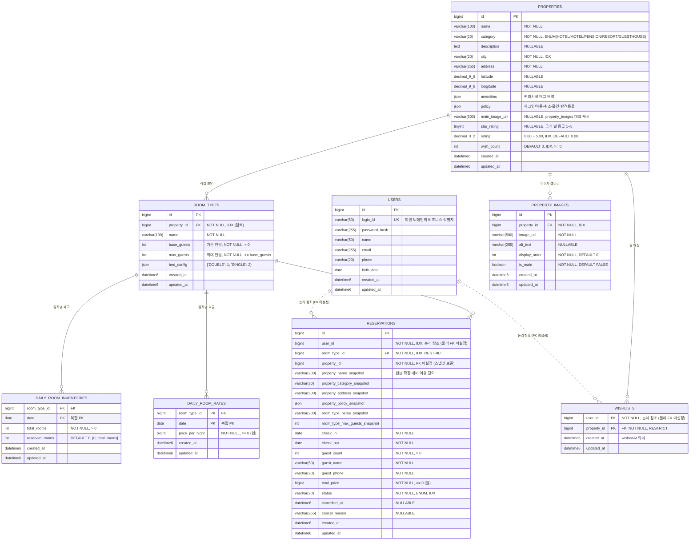

# 04 — ERD

> **DB 엔진**: MySQL 8 (또는 MariaDB) 가정. JPA 매핑 전제.
> **명명 규약**: 테이블 `snake_case` 복수형, 컬럼 `snake_case`. PK 는 `id BIGINT AUTO_INCREMENT` 기본. 일자 / 조합 자연 키 테이블은 복합 PK.
>
> **연관 문서**:
> - `00-ubiquitous-language.md` — **단일 어휘 사전** (테이블·컬럼명이 도메인 용어와 정합해야 한다)
> - 도메인 모델 ↔ 테이블 매핑은 `03-class-diagram.md`
> - 후속 테이블 자리 (Rate Plan / Coupon / Payment / Review / Outbox / Hold) 와 마이그레이션 시나리오는 `05-domain-landscape.md §2 / §8`
> - API 요청 페이로드 (어드민 일괄 등록 등) 는 `01-requirements.md §10` 및 별도 OpenAPI 명세
>
> **문서 구조**:
> 1. **Context & Scope** (§1) — 본 문서의 범위 / 다루지 않는 것
> 2. **Conventions** (§2) — DB 컨벤션 / 명명 / 시간대 / 삭제 정책
> 3. **Overview** (§3) — 데이터 소유·카디널리티 + 전체 ERD
> 4. **Detailed Specs** (§4) — 테이블별 [DDL → 제약 → 인덱스 → 용량] 통합 명세 (Aggregate 단위 묶음)
> 5. **운영 시나리오** (§5) — 핵심 트랜잭션의 DB Row 변화

---

## §1 Context & Scope

**다루는 것**:
- 본 시스템의 영속성 스키마 (테이블 / 컬럼 / 인덱스 / 제약 / 외래키 / 용량 산정)
- DB 엔진 / 시간대 / 문자셋 같은 물리 정책
- 핵심 트랜잭션의 행(row) 변화 시나리오

**다루지 않는 것**:
- 도메인 객체 모델 (Aggregate / VO / Entity) → `03-class-diagram.md`
- API 요청·응답 형식 → `01-requirements.md §10` + OpenAPI
- ORM 어노테이션 / Repository 구현 결정 → 구현 코드와 함께 결정
- 후속 도메인 (Payment / Coupon / Review 등) 의 테이블 → `05-domain-landscape.md`

---

## §2 Conventions — DB 컨벤션

본 ERD 전체에 적용되는 컨벤션. 각 테이블 절에서 다시 적지 않는다.

> 일부 항목 (Charset / Timezone / DATETIME 정책) 은 본 시스템을 넘어 **저장소 전역 컨벤션** 으로 승격할 수 있는 후보. 별도 `architecture-guidelines` 신설 시 이관 검토.

### 2.1 물리 엔진 / 문자셋 / 시간대

| 항목 | 결정 |
|---|---|
| **Engine** | InnoDB (FK / 트랜잭션 / row-lock) |
| **Charset / Collation** | `utf8mb4 / utf8mb4_0900_ai_ci` (MySQL 8 기본 — 다국어 / 악센트 무시 정렬 / 성능 우수. `utf8mb4_unicode_ci` 는 레거시) |
| **Server Timezone** | `time_zone = '+00:00'` (UTC) 고정. `CURRENT_TIMESTAMP` 가 server tz 의존이므로 명시 고정 — server tz 가 KST 인 환경과 UTC 인 환경이 같은 컬럼에서 다른 절대시각을 가리키는 사고 방지 |
| **타임스탬프 타입** | **`DATETIME(6)`** (UTC 저장 + μs 정밀도). `TIMESTAMP` 는 2038 오버플로로 미사용 |
| **DATE 타입** | KST 기준 "그날" 의미. `DATE` 변환은 서비스 레이어에서 `Asia/Seoul` 명시 |

### 2.2 타입 / ENUM / JSON

| 항목 | 결정 |
|---|---|
| **금액 단위** | KRW 원 단위 정수 `BIGINT`. `DECIMAL` 미사용 (KRW 소수 없음, 정수 연산이 빠르고 부동소수 오류 회피) |
| **ENUM 표현** | MySQL native `ENUM` 미사용 (`ALTER` 비용). `VARCHAR(20)` + 애플리케이션 enum 강제 |
| **JSON** | MySQL 8 native `JSON`. 스칼라 추출은 generated column. **배열 검색은 Multi-Valued Index** (`CAST(... AS ... ARRAY)`, 8.0.17+) |
| **공통 컬럼** | 모든 테이블 `created_at` / `updated_at` 보유 — `DATETIME(6) NOT NULL DEFAULT CURRENT_TIMESTAMP(6)` / `ON UPDATE CURRENT_TIMESTAMP(6)` |

### 2.3 삭제 / 외래키 / 멱등 정책

| 항목 | 결정 |
|---|---|
| **삭제 정책** | **Hard delete 금지** (마스터 데이터). `status (ACTIVE / INACTIVE / ARCHIVED)` 컬럼으로 운영 — 과거 예약·찜·통계 정합성 보존. 영구 삭제는 컴플라이언스 보존기간 경과 후 배치 |
| **외래키 cascade** | **`ON DELETE RESTRICT` 기본**. 대량 cascade 는 row-lock 폭주 / 데드락 — 자식 데이터 일괄 정리는 애플리케이션이 chunk 단위로 |
| **회원 도메인 FK** | `users` 는 외부 도메인 소유. `reservations.user_id` / `wishlists.user_id` 는 **물리 FK 미설정** — Application 레이어에서 `LoginId` 기반 무결성 검증. ERD 의 점선 관계는 논리 참조 |
| **멱등 토글** | 찜처럼 멱등이 본질인 토글은 **UNIQUE 제약 + Upsert / INSERT IGNORE** 패턴. Check-Then-Act 회피 (race window 제거) |
| **Soft delete 전용 컬럼** | 마스터 데이터는 `status` 로 충분. 트랜잭션 데이터 (`reservations` 등) 는 `cancelled_at` 같은 상태 시각 컬럼만 보유. 별도 `deleted_at` 컬럼은 컴플라이언스 요건 발생 시 도입 |

---

## §3 Overview — 데이터 소유 + 전체 ERD

### 3.1 데이터 소유 / 카디널리티 / 핫스팟

| 테이블 | 소유 Aggregate | 카디널리티 | 변경 빈도 | 재평가 트리거 |
|---|---|---|---|---|
| `users` | (기존 회원 도메인) | 1 게스트 = 1 행 | 회원가입 / 정보 수정 | 회원 ≥ 100만 |
| `properties` | Property | 1 숙소 = 1 행 | 어드민 등록 / 수정 | 숙소 ≥ 1k (검색 N+1 측정) |
| `property_images` | Property | 1 숙소 : N (~10) 이미지 | 어드민 갱신 | 이미지 ≥ 10k (CDN 전환) |
| `room_types` | RoomType | 1 숙소 : N 객실 타입 | 어드민 등록 / 수정 | 객실 타입 ≥ 5k |
| `daily_room_inventories` | DailyRoomInventory | 1 객실 타입 × 1 날짜 = 1 행 | **핫스팟** — 예약 시 차감 | 1년치 ≥ 1.8M (`§4.4 용량` 참조) |
| `daily_room_rates` | DailyRoomRate | 1 객실 타입 × 1 날짜 = 1 행 | 어드민 일괄 등록, 가격 조정 | Rate Plan 도입 (`05 §2.1`) |
| `wishlists` | Wishlist | 1 게스트 × 1 숙소 = 0~1 행 | **핫스팟** — 게스트 토글 | 행 ≥ 10M (카운터 분리) |
| `reservations` | Reservation | 1 예약 = 1 행 (스냅샷 보유) | **핫스팟** — 예약 / 취소 | 행 ≥ 5M (월 파티션 검토) |

> 인덱스·캐시·동시성 제어는 본 ERD 가 **MVP 기준선**. 위 트리거 조건 도달 시 재평가 (운영 메트릭 + 쿼리 측정 결과 기준).

### 3.2 전체 ERD



> Mermaid `erDiagram` 은 `varchar(N)` / `decimal(p,s)` 표기 미지원이라 `varchar_100` / `decimal_9_6` 으로 표기. `datetime6` 은 `DATETIME(6)` 의미. 실제 DDL 은 §4 참조.

---

## §4 Detailed Specs — 테이블별 명세

> **블록 포맷**: 각 테이블은 `(1) DDL → (2) 제약·인덱스 결정 근거 → (3) 용량 산정` 의 동일 포맷. Aggregate 단위로 묶는다.

### 4.1 Property Aggregate (`properties` / `property_images`)

#### 4.1.1 DDL

```sql
CREATE TABLE properties (
    id                BIGINT AUTO_INCREMENT PRIMARY KEY,
    name              VARCHAR(100)  NOT NULL,
    category          VARCHAR(20)   NOT NULL,
    description       TEXT          NULL,
    city              VARCHAR(20)   NOT NULL,
    address           VARCHAR(255)  NOT NULL,
    latitude          DECIMAL(9,6)  NULL,
    longitude         DECIMAL(9,6)  NULL,
    amenities         JSON          NULL,
    policy            JSON          NULL,
    main_image_url    VARCHAR(500)  NULL,
    star_rating       TINYINT       NULL,
    rating            DECIMAL(3,2)  NOT NULL DEFAULT 0.00,
    wish_count        INT           NOT NULL DEFAULT 0,
    status            VARCHAR(20)   NOT NULL DEFAULT 'ACTIVE',
    created_at        DATETIME(6)   NOT NULL DEFAULT CURRENT_TIMESTAMP(6),
    updated_at        DATETIME(6)   NOT NULL DEFAULT CURRENT_TIMESTAMP(6) ON UPDATE CURRENT_TIMESTAMP(6),
    CONSTRAINT chk_properties_star    CHECK (star_rating IS NULL OR star_rating BETWEEN 1 AND 5),
    CONSTRAINT chk_properties_rating  CHECK (rating BETWEEN 0.00 AND 5.00),
    CONSTRAINT chk_properties_wishes  CHECK (wish_count >= 0),
    CONSTRAINT chk_properties_status  CHECK (status IN ('ACTIVE','INACTIVE','ARCHIVED')),
    INDEX idx_properties_city_rating (city, rating),
    INDEX idx_properties_city_wishes (city, wish_count),
    INDEX idx_properties_city_star   (city, star_rating)
) ENGINE=InnoDB DEFAULT CHARSET=utf8mb4 COLLATE=utf8mb4_0900_ai_ci;

CREATE TABLE property_images (
    id            BIGINT AUTO_INCREMENT PRIMARY KEY,
    property_id   BIGINT       NOT NULL,
    image_url     VARCHAR(500) NOT NULL,
    alt_text      VARCHAR(255) NULL,
    display_order INT          NOT NULL DEFAULT 0,
    is_main       BOOLEAN      NOT NULL DEFAULT FALSE,
    created_at    DATETIME(6)  NOT NULL DEFAULT CURRENT_TIMESTAMP(6),
    updated_at    DATETIME(6)  NOT NULL DEFAULT CURRENT_TIMESTAMP(6) ON UPDATE CURRENT_TIMESTAMP(6),
    CONSTRAINT fk_property_images FOREIGN KEY (property_id) REFERENCES properties(id) ON DELETE RESTRICT,
    INDEX idx_property_images (property_id, display_order)
) ENGINE=InnoDB DEFAULT CHARSET=utf8mb4 COLLATE=utf8mb4_0900_ai_ci;
```

#### 4.1.2 컬럼·제약 결정 근거

| 컬럼 / 제약 | 결정 | 근거 |
|---|---|---|
| `category` | `VARCHAR(20)` + 애플리케이션 enum | native ENUM 의 `ALTER` 비용 회피 |
| `policy` / `amenities` | `JSON` | 매핑은 인프라 레이어 `AttributeConverter` — `ObjectMapper` 의존 도메인 누출 차단 |
| `amenities` 검색 | 배열 검색 도입 시 **Multi-Valued Index** (`CAST(... AS CHAR(20) ARRAY)`, 8.0.17+) | 단순 generated column 은 배열 인덱스 불가 |
| `main_image_url` | `property_images` 대표 행의 역정규화 캐시 | 검색 응답에서 join 회피 |
| `is_main` | DB UNIQUE 미사용 (partial index 비지원) | 도메인 레벨에서 0~1개 보장 |
| **`main_image_url` ↔ `property_images.is_main` 동기화** | 단일 트랜잭션 내 `Property.replaceMainImage(imageId)` 도메인 메서드만 양쪽 갱신을 허용 — Repository 가 다른 경로로 `is_main` 또는 `main_image_url` 을 갱신하지 못하게 캡슐화 | 역정규화 캐시는 DB 제약으로 강제 불가 (서로 다른 테이블) — 도메인 메서드 단일 진입점 + **정합성 점검 배치** (`is_main=TRUE` 행의 `image_url` ≠ `properties.main_image_url` 인 행 0건 검증) 로 보완 |
| `star_rating` | `TINYINT NULL` + CHECK 1~5 | 공식 별 등급 (`rating` 사용자 평점과 분리). NULL = 무등급 (펜션 / 게스트하우스) |
| `rating` | `DECIMAL(3,2)` | 사용자 평점 (0.00~5.00) — 리뷰 도메인 도입 시 비동기 재계산 |
| `wish_count` | `INT` + CHECK ≥ 0 | `INT UNSIGNED` 는 JPA / Kotlin `Int` 호환 회피 |
| `status` | `VARCHAR(20)` + CHECK | hard delete 대체. `ACTIVE → INACTIVE → ARCHIVED` 전이 |
| `description` | `TEXT` | 풀텍스트 인덱스 / ES 는 검색 인프라 도입 단계 |

#### 4.1.3 인덱스 전략

| 인덱스 | 커버 쿼리 |
|---|---|
| `(city, rating)` | 도시 + 평점 정렬. leftmost prefix 로 `city` 단독 쿼리도 커버 |
| `(city, wish_count)` | 도시 + 찜 수 정렬 |
| `(city, star_rating)` | 도시 + 등급 필터 (5성 호텔만) |

> **선택지 비교**: `(city)`, `(rating)`, `(wish_count)` 단독 인덱스는 도입하지 않는다 — `(city, *)` 결합의 leftmost prefix 와 중복. 전역 정렬 (도시 무관) 은 운영 트래픽이 입증되기 전까지 보류.

#### 4.1.4 용량 / 핫스팟 / 재평가 트리거

| 항목 | 임계 | 대응 |
|---|---|---|
| `properties` 행 수 | ≥ 10k | 검색 latency P95 측정 (EXPLAIN + slow query 로그). 필요 시 batch IN 시그니처 + 캐시 read model 도입 |
| `property_images` 행 수 | ≥ 100k | 갤러리 일괄 조회 latency 측정. CDN edge 캐싱 검증 |
| `properties.wish_count` 갱신 경합 | 단일 hot property 에서 토글 ≥ 100 RPS 또는 `SHOW ENGINE INNODB STATUS` 의 row lock wait 누적 | `property_stats (property_id PK, wish_count, rating)` 카운터 분리 또는 Redis 카운터 + 비동기 write-back. **단일 컬럼 갱신은 10 RPS 수준에선 InnoDB 가 충분히 흡수** |

---

### 4.2 RoomType Aggregate (`room_types`)

#### 4.2.1 DDL

```sql
CREATE TABLE room_types (
    id           BIGINT AUTO_INCREMENT PRIMARY KEY,
    property_id  BIGINT       NOT NULL,
    name         VARCHAR(100) NOT NULL,
    base_guests  INT          NOT NULL,
    max_guests   INT          NOT NULL,
    bed_config   JSON         NULL,
    status       VARCHAR(20)  NOT NULL DEFAULT 'ACTIVE',
    created_at   DATETIME(6)  NOT NULL DEFAULT CURRENT_TIMESTAMP(6),
    updated_at   DATETIME(6)  NOT NULL DEFAULT CURRENT_TIMESTAMP(6) ON UPDATE CURRENT_TIMESTAMP(6),
    CONSTRAINT fk_room_types_property FOREIGN KEY (property_id) REFERENCES properties(id) ON DELETE RESTRICT,
    CONSTRAINT chk_room_types_base    CHECK (base_guests > 0),
    CONSTRAINT chk_room_types_max     CHECK (max_guests >= base_guests),
    CONSTRAINT chk_room_types_status  CHECK (status IN ('ACTIVE','INACTIVE','ARCHIVED')),
    INDEX idx_room_types_property (property_id)
) ENGINE=InnoDB DEFAULT CHARSET=utf8mb4 COLLATE=utf8mb4_0900_ai_ci;
```

#### 4.2.2 결정 근거

| 컬럼 / 제약 | 결정 | 근거 |
|---|---|---|
| `property_id` FK RESTRICT | 객실 타입은 숙소 폐쇄 시 status 운영으로 함께 비활성 | cascade 폭주 회피 |
| `base_guests` / `max_guests` 분리 | 두 컬럼 보유 + `max >= base` CHECK | 추가 인원 정책 / 검색 필터 양쪽에 활용 |
| `bed_config` JSON | `{"DOUBLE":1,"SINGLE":2}` 형태 | 검색 필터로 들어오면 generated column 검토 |

#### 4.2.3 용량 / 재평가 트리거

| 항목 | 임계 | 대응 |
|---|---|---|
| `room_types` 행 수 | ≥ 5k | 검색의 RoomType → Inventory join 측정. batch IN 시그니처 유지 |

---

### 4.3 Daily-Stock Aggregate (`daily_room_inventories` / `daily_room_rates`)

#### 4.3.1 DDL

```sql
CREATE TABLE daily_room_inventories (
    room_type_id   BIGINT      NOT NULL,
    date           DATE        NOT NULL,
    total_rooms    INT         NOT NULL,
    reserved_rooms INT         NOT NULL DEFAULT 0,
    created_at     DATETIME(6) NOT NULL DEFAULT CURRENT_TIMESTAMP(6),
    updated_at     DATETIME(6) NOT NULL DEFAULT CURRENT_TIMESTAMP(6) ON UPDATE CURRENT_TIMESTAMP(6),
    PRIMARY KEY (room_type_id, date),
    CONSTRAINT fk_dri_room_type FOREIGN KEY (room_type_id) REFERENCES room_types(id) ON DELETE RESTRICT,
    CONSTRAINT chk_dri_total_pos       CHECK (total_rooms > 0),
    CONSTRAINT chk_dri_reserved_nonneg CHECK (reserved_rooms >= 0 AND reserved_rooms <= total_rooms)
) ENGINE=InnoDB DEFAULT CHARSET=utf8mb4 COLLATE=utf8mb4_0900_ai_ci;

CREATE TABLE daily_room_rates (
    room_type_id    BIGINT      NOT NULL,
    date            DATE        NOT NULL,
    price_per_night BIGINT      NOT NULL,
    created_at      DATETIME(6) NOT NULL DEFAULT CURRENT_TIMESTAMP(6),
    updated_at      DATETIME(6) NOT NULL DEFAULT CURRENT_TIMESTAMP(6) ON UPDATE CURRENT_TIMESTAMP(6),
    PRIMARY KEY (room_type_id, date),
    CONSTRAINT fk_drr_room_type FOREIGN KEY (room_type_id) REFERENCES room_types(id) ON DELETE RESTRICT,
    CONSTRAINT chk_drr_price_nonneg CHECK (price_per_night >= 0)
) ENGINE=InnoDB DEFAULT CHARSET=utf8mb4 COLLATE=utf8mb4_0900_ai_ci;
```

#### 4.3.2 결정 근거

| 결정 | 근거 |
|---|---|
| 복합 PK `(room_type_id, date)` | 자연 키. 인공 `id` 추가 시 unique 제약 + 인덱스 1개 더 |
| 추가 인덱스 없음 | PK leftmost prefix 가 `WHERE room_type_id = ? AND date BETWEEN ? AND ?` 완전 커버 |
| 역방향 `(date, room_type_id)` 인덱스 | "특정 일자 전체 inventory" 통계 쿼리 도입 시 추가 |
| `reserved_rooms` 음수 / 초과 방지 | 도메인 + DB CHECK 다중 방어. 동시성 단계의 Atomic UPDATE 가드로 동작 |
| `ON DELETE RESTRICT` | RoomType 직접 삭제 시 일자 데이터를 애플리케이션이 chunk 삭제 — DB 레벨 cascade 의 락 폭주 회피 |

#### 4.3.3 용량 / Cartesian product / 파티셔닝

> 본 Aggregate 는 `RoomType × Date` 의 Cartesian product 가 곧 행 수. 모델이 곧 운영 비용을 결정한다.

| 시나리오 | RoomType 수 | 등록 기간 | 행 수 | 평가 / 대응 |
|---|---|---|---|---|
| 초기 도입 | 1k | 1년 | 36.5만 | InnoDB 단일 테이블 충분 |
| 중기 | 10k | 1년 | 365만 | 단일 테이블 + 결합 인덱스로 무리 없음 |
| 대형 | 100k | 1년 | 3,650만 | 인덱스 튜닝 / 슬로우 쿼리 모니터링으로 *우선 대응*. 파티셔닝은 EXPLAIN 분석 후 결정 |
| 초대형 | 500k+ | 1년 | 1.8억+ | **`date` 기반 RANGE 파티셔닝 적용 검토 시점**. 라이브 PK 재구성 비용이 큰 만큼 100k → 500k 구간에서 사전 설계 |
| OTA 분배 급 | 1M+ | 1년 | 3.65억+ | 샤딩 / 검색 엔진 필수. 본 ERD 범위 외 |

> **파티셔닝 타이밍**: 3,650만 행 (100k × 365) 은 InnoDB + 결합 인덱스 (`PK (room_type_id, date)`) 로 충분히 대응 가능 — 단일 객실 1년치 범위 쿼리는 정밀 인덱스 lookup 이라 데이터 절대량과 무관. 파티셔닝 도입은 **(a) 일자 전역 조회 / (b) 월 단위 백업·아카이브 요구 / (c) EXPLAIN 분석상 PK 효율 저하** 가 관측될 때 — 일반적으로 500k+ RoomType 또는 명시 트리거 발생 후.

---

### 4.4 Wishlist Aggregate (`wishlists`)

#### 4.4.1 DDL

```sql
CREATE TABLE wishlists (
    user_id     BIGINT      NOT NULL,
    property_id BIGINT      NOT NULL,
    created_at  DATETIME(6) NOT NULL DEFAULT CURRENT_TIMESTAMP(6),
    updated_at  DATETIME(6) NOT NULL DEFAULT CURRENT_TIMESTAMP(6) ON UPDATE CURRENT_TIMESTAMP(6),
    PRIMARY KEY (user_id, property_id),
    CONSTRAINT fk_wishlists_property FOREIGN KEY (property_id) REFERENCES properties(id) ON DELETE RESTRICT,
    INDEX idx_wishlists_property (property_id)
) ENGINE=InnoDB DEFAULT CHARSET=utf8mb4 COLLATE=utf8mb4_0900_ai_ci;
```

#### 4.4.2 결정 근거

| 결정 | 근거 |
|---|---|
| PK `(user_id, property_id)`, leftmost = `user_id` | "내가 찜한 숙소" 쿼리가 가장 빈번 |
| `property_id` 단독 인덱스 | 숙소별 찜 카운트 / `properties.wish_count` 갱신 |
| `user_id` 물리 FK 미설정 | 회원 도메인 분리 — Application 검증 (§2.3) |
| `property_id` `ON DELETE RESTRICT` | Property 의 hard delete 는 status 운영으로 대체 |
| **Upsert / `INSERT IGNORE`** | 멱등 토글은 `ON DUPLICATE KEY UPDATE` 또는 `DataIntegrityViolationException` Catch — Check-Then-Act 회피 |

#### 4.4.3 용량 / 재평가 트리거

| 항목 | 임계 | 대응 |
|---|---|---|
| `wishlists` 행 수 | ≥ 50M | `property_id` 단독 인덱스 사용 패턴 측정 후 read-replica 분리 검토 |
| `properties.wish_count` 핫스팟 | 단일 hot property 의 토글 100 RPS 이상 또는 row lock wait 누적 | `property_stats` 카운터 테이블 분리 또는 Redis 카운터 + 비동기 write-back |

---

### 4.5 Reservation Aggregate (`reservations`)

#### 4.5.1 DDL

```sql
CREATE TABLE reservations (
    id                              BIGINT AUTO_INCREMENT PRIMARY KEY,
    user_id                         BIGINT       NOT NULL,                  -- 논리 참조, 물리 FK 미설정
    room_type_id                    BIGINT       NOT NULL,
    property_id                     BIGINT       NOT NULL,                  -- 스냅샷 키
    property_name_snapshot          VARCHAR(200) NOT NULL,
    property_category_snapshot      VARCHAR(30)  NOT NULL,
    property_address_snapshot       VARCHAR(500) NOT NULL,
    property_policy_snapshot        JSON         NOT NULL,
    room_type_name_snapshot         VARCHAR(200) NOT NULL,
    room_type_max_guests_snapshot   INT          NOT NULL,
    check_in                        DATE         NOT NULL,
    check_out                       DATE         NOT NULL,
    guest_count                     INT          NOT NULL,
    guest_name                      VARCHAR(100) NOT NULL,
    guest_phone                     VARCHAR(20)  NOT NULL,
    total_price                     BIGINT       NOT NULL,
    status                          VARCHAR(20)  NOT NULL,
    cancelled_at                    DATETIME(6)  NULL,
    cancel_reason                   VARCHAR(255) NULL,
    created_at                      DATETIME(6)  NOT NULL DEFAULT CURRENT_TIMESTAMP(6),
    updated_at                      DATETIME(6)  NOT NULL DEFAULT CURRENT_TIMESTAMP(6) ON UPDATE CURRENT_TIMESTAMP(6),
    CONSTRAINT fk_reservations_room_type FOREIGN KEY (room_type_id) REFERENCES room_types(id) ON DELETE RESTRICT,
    CONSTRAINT chk_reservations_dates    CHECK (check_out > check_in),
    CONSTRAINT chk_reservations_guests   CHECK (guest_count > 0),
    CONSTRAINT chk_reservations_price    CHECK (total_price >= 0),
    CONSTRAINT chk_reservations_status   CHECK (status IN ('PENDING','CONFIRMED','CHECKED_IN','CHECKED_OUT','CANCELLED','NO_SHOW')),
    INDEX idx_reservations_user_status  (user_id, status),
    INDEX idx_reservations_user_checkin (user_id, check_in),
    INDEX idx_reservations_room_checkin (room_type_id, check_in)
) ENGINE=InnoDB DEFAULT CHARSET=utf8mb4 COLLATE=utf8mb4_0900_ai_ci;
```

#### 4.5.2 스냅샷 / FK 결정

| 컬럼 | 결정 | 근거 |
|---|---|---|
| `user_id` | 물리 FK 미설정, 논리 참조 | 회원 도메인 분리. 회원 탈퇴 시 예약 이력은 익명화 정책으로 보존 — 본 ERD 는 회원 측 정책 변경에 종속되지 않는다 |
| `room_type_id` | FK, ON DELETE RESTRICT | 객실 타입 기준 어드민 조회. RoomType 폐쇄 시 status 운영 |
| `property_id` | FK 미설정 | RoomType 통해 추적 가능. 스냅샷이 정보 보존 책임 |
| `*_snapshot` 컬럼 | NOT NULL + **원본 대비 1.5~2배 길이** (예: 원본 `VARCHAR(100)` → 스냅샷 `VARCHAR(200)`) | 영수증 성격. 향후 원본 컬럼 확장 시 스냅샷 행이 잘리지 않게 |
| `cancelled_at` / `cancel_reason` | NULLABLE | 취소 시각·사유 (CS / 통계용) |

#### 4.5.3 인덱스 전략

| 인덱스 | 커버 쿼리 | 카디널리티 |
|---|---|---|
| `(user_id, status)` | 본인 예약 목록 + 상태 필터 (가장 빈번) | 높음 (user_id 주도) |
| `(user_id, check_in)` | 본인 예약 + 기간 필터 | 높음 |
| `(room_type_id, check_in)` | 어드민 객실 타입별 기간 조회 | 높음 |

> **도입하지 않는 인덱스**:
> - `(status)` 단독 — 카디널리티 극단적으로 낮음 (6종). 옵티마이저가 풀스캔 선호. 대시보드 카운트는 read-replica 또는 캐시
> - `(check_in, check_out)` 운영 통계용 — 발생 빈도가 낮은 쿼리에 INSERT / UPDATE 부담만 증가. 통계는 OLAP / read-replica 로 분리
>
> `reservations` 는 INSERT / UPDATE 가 잦은 핫스팟. 인덱스 수가 곧 Write 비용 — 3개로 한정한다.

#### 4.5.4 용량 / 재평가 트리거

| 항목 | 임계 | 대응 |
|---|---|---|
| `reservations` 행 수 | 절대 행수보다 *EXPLAIN 분석* 우선. 통상 50M+ 또는 단일 일자 / 단일 user 쿼리 latency P95 > 200ms 가 관측될 때 | 월 단위 파티션 (`check_in` 기준 RANGE) 또는 `status = 'CANCELLED'` 이력 아카이브 테이블 분리. *5M 수준에서는 인덱스 튜닝으로 충분* — 조기 파티셔닝은 운영 복잡도만 증가 |
| 인덱스 추가 요청 발생 | 운영 트래픽 / EXPLAIN 분석 후 | 새 인덱스 추가 전 기존 인덱스 활용 가능성 검증 |
| `cancelled_at IS NOT NULL` 행 비중 | ≥ 30% | 활성 / 이력 분리 검토 (`reservations_archive`). 어드민 통계는 OLAP / read-replica 활용 |

---

### 4.6 외부 회원 도메인 참조 (`users`)

- `users` 는 외부 회원 도메인의 테이블 — 본 ERD 는 형태만 참조한다.
- `reservations.user_id` / `wishlists.user_id` 는 `users.id` 를 **논리적으로** 참조 (물리 FK 없음, §2.3).
- 도메인 모델 코드는 `LoginId` (string VO) 로 유저를 식별하고 Repository 가 `LoginId ↔ users.id` 변환 — 본 매핑 세부는 `03-class-diagram.md §6` 참조.
- 무결성 보증: Application 레이어에서 `users.login_id` 존재 확인. 회원 탈퇴 / 익명화 이벤트 발생 시 본 도메인은 별도 정책 (예약 이력 유지, 식별자 마스킹) 으로 대응.

---

## §5 운영 시나리오 — 핵심 트랜잭션의 Row 변화

> API 페이로드 / 입력 형식은 `01-requirements.md §10` + OpenAPI 명세. 본 절은 **DB 행이 어떻게 변하는지** 만 본다.

### 5.1 일자별 재고 / 요금 일괄 등록

어드민이 `(roomTypeId=5520, 2026-05-01 ~ 2026-05-31, totalRooms=10, pricePerNight=120000)` 으로 등록:

```
daily_room_inventories  (31 rows insert/upsert)
| room_type_id | date       | total_rooms | reserved_rooms |
|        5520  | 2026-05-01 |          10 |              0 |
|        ...                                              |
|        5520  | 2026-05-31 |          10 |              0 |

daily_room_rates  (31 rows insert/upsert)
| room_type_id | date       | price_per_night |
|        5520  | 2026-05-01 |          120000 |
|        ...                                  |
```

> upsert 의미: 존재하면 UPDATE, 없으면 INSERT. MVP 는 JPA `saveAll` + 사전 조회. 대량 배치는 `INSERT ... ON DUPLICATE KEY UPDATE` 검토.

### 5.2 예약 1건 — 2박 (5/10 ~ 5/12)

```
reservations  (1 row insert)
| id | user_id | room_type_id | property_id | check_in   | check_out  | guest_count | total_price | status   |
| 1  |     42  |        5520  |       1024  | 2026-05-10 | 2026-05-12 |           2 |      240000 | PENDING  |

daily_room_inventories  (2 rows update — 체크아웃 당일 제외)
| room_type_id | date       | reserved_rooms 변화 |
|        5520  | 2026-05-10 |  0 → 1              |
|        5520  | 2026-05-11 |  0 → 1              |
|        5520  | 2026-05-12 |  변화 없음 (체크아웃) |
```

> **정책 검수**: `StayPeriod.datesToReserve()` 가 `[5/10, 5/11]` 만 반환 (체크아웃 당일 X) — `03-class-diagram.md §7` 도메인 보장.

### 5.3 예약 취소

```
reservations  (1 row update)
| id | status    | cancelled_at        |
| 1  | CANCELLED | 2026-05-03 10:12:00 |

daily_room_inventories  (2 rows update — 복원)
| room_type_id | date       | reserved_rooms 변화 |
|        5520  | 2026-05-10 |  1 → 0              |
|        5520  | 2026-05-11 |  1 → 0              |
```

---

## §6 후속 확장의 자리

> 본 ERD 에 들이지 않는 테이블 / 컬럼의 도입 트리거 / 마이그레이션 시나리오는 **`05-domain-landscape.md §2 / §8 / Appendix A` 의 단일 출처** 를 따른다.
>
> 본 문서는 ERD 의 현재 상태만 책임지며, 후속 테이블의 자리 (Rate Plan / Coupon / Payment / Hold / Outbox / Review / Audit / Idempotency / OTA Channel / 풀텍스트) 의 정의는 05 로 위임한다. 본 ERD 의 키 / 컬럼이 후속 변경을 흡수할 수 있도록 설계된 가드는 §2 (`status` / 물리 FK 미설정 / 보수적 스냅샷 길이 등) 에 기록되어 있다.
