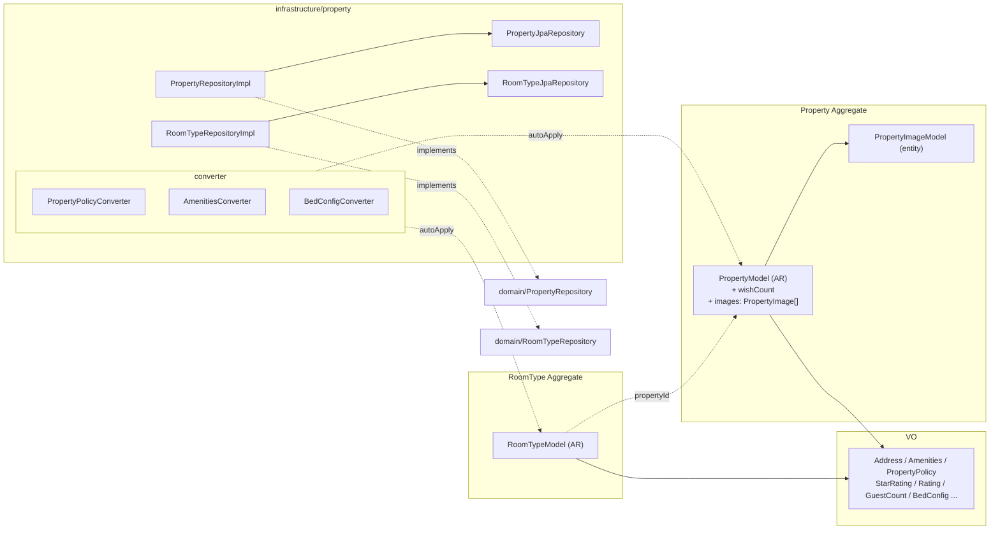

# feat: 숙소 / 객실 타입 / 이미지 갤러리 도메인 추가

## TL;DR

3주차 도메인 구현의 첫 단계로 Property Aggregate 와 RoomType Aggregate 를 추가했다. design doc 03 §0 결정에 따라 두 도메인은 **별도 Aggregate** 로 두되, 라이프사이클을 함께 다루는 PropertyImage 만 Property AR 의 자식 entity 로 묶었다. PropertyService 는 만들지 않았다 — 검색은 후속 Facade 가 Repository 를 조립하면 충분하다는 결정 (`03 §6`). JSON 컬럼 매핑(PropertyPolicy / Amenities / BedConfig) 은 `infrastructure/property/converter/` 의 `@Converter(autoApply = true)` 컨버터로 처리해 도메인이 Jackson 의존성을 import 하지 않도록 했다. 본 PR 의 게이트(`verify-architecture` / `verify-tests`) 는 모두 PASS 이며, Controller / Facade 는 후속 `feature/property-facades` 브랜치로 분리한다.

## 무엇을 바꿨나

| 영역 | 추가된 산출물 |
|---|---|
| 공용 VO | `domain/common/value/Money.kt` (KRW 정수, 음수 거부, plus/times) |
| Property AR | `domain/property/PropertyModel.kt` + `PropertyImageModel.kt` (자식 entity) |
| RoomType AR | `domain/property/RoomTypeModel.kt` (별도 AR) |
| Property VO (10개) | `Name`, `Address`, `Geo`, `Amenities` + `AmenityTag`, `PropertyCategory`, `PropertyPolicy` + `CancellationPolicy` + `CancellationType`, `StarRating`, `Rating` |
| RoomType VO | `GuestCount`, `BedConfig` + `BedType` |
| Repository | `domain/property/{PropertyRepository,RoomTypeRepository}.kt` (인터페이스) + `infrastructure/property/{PropertyJpaRepository,PropertyRepositoryImpl,RoomTypeJpaRepository,RoomTypeRepositoryImpl}.kt` |
| JSON 컨버터 | `infrastructure/property/converter/{PropertyPolicyConverter,AmenitiesConverter,BedConfigConverter}.kt` (autoApply) |
| 테스트 더블 | `support/test/{InMemoryPropertyRepository,InMemoryRoomTypeRepository}.kt` |
| 단위 테스트 | 14개 클래스 / 55 테스트 (Money 5 + Property 모델 7 + RoomType 모델 3 + VO 34 + Converter round-trip 6) |

## 핵심 구조 한눈에

의존성은 **항상 안쪽으로만**. 도메인이 infrastructure 컨버터를 import 하지 않도록 `@Converter(autoApply = true)` 로 우회한 것이 본 PR 의 가장 미묘한 결정이다.

## 고민과 선택

### 1. PropertyService 만들 것인가 — 만들지 않았다

대안 (A) `PropertyService` 를 두고 검색 정렬 / 가용성 판정 / 인원 검증 위임 / **(B) 만들지 않고 후속 Facade 가 Repository 들을 직접 조립**.

(B) 선택. design doc 03 §6 의 결정을 그대로 답습한다. 인원 검증은 `RoomType.checkGuestCount()` 모델 메서드로 충분하고, 검색 정렬은 Repository 의 `findByCity(city, sort, page)` 시그니처 + Facade 가 가용성 / 합산가를 조립하는 흐름이 자연스럽다. Service 가 단지 Repository 호출을 한 번 더 감싸기만 한다면 그 레이어는 불필요한 비용. 도메인 규칙으로 들어올 게 생기면 그때 도입.

### 2. PropertyImage — 별도 AR vs Property 자식 entity

대안 (A) 별도 AR / **(B) Property 의 자식 entity (`@OneToMany cascade = ALL`)**.

(B) 선택. 이미지 갤러리는 Property 라이프사이클에 종속이고, `is_main = TRUE` 가 한 Property 당 0~1개라는 도메인 불변식이 **컬렉션 차원에서** 강제되어야 한다. 별도 AR 로 두면 `replaceMainImage(url)` 흐름에서 두 Aggregate 를 동시 변경하는 트랜잭션이 또 늘어난다. 자식으로 묶으면 `addImage` / `replaceMainImage` 모델 메서드가 컬렉션과 `mainImageUrl` 캐시 컬럼을 같은 트랜잭션 안에서 일관되게 갱신.

### 3. RoomType — Property 의 자식 vs 별도 AR

대안 (A) Property 의 자식 entity (PropertyImage 와 같은 패턴) / **(B) 별도 AR (참조는 `propertyId: Long` 만)**.

(B) 선택. RoomType 은 어드민이 단독으로 추가/수정/삭제하는 라이프사이클이다(main.md 어드민 API 표). Property AR 안에 컬렉션으로 두면 검색·가용성 쿼리에서 항상 RoomType 까지 끌고 오는 압박이 생긴다 (성능 트레이드오프 악화). 별도 AR + ID 참조가 4주차 검색 N+1 정리에 자연스럽다.

### 4. JSON 컬럼 매핑 — `@Convert(converter = X::class)` vs `autoApply`

대안 (A) `@Convert(converter = PropertyPolicyConverter::class)` 를 도메인 모델에 직접 / **(B) 컨버터에 `@Converter(autoApply = true)` + 도메인 모델은 무어노테이션**.

(B) 선택. 처음에 (A) 로 시작했으나 즉시 발견한 문제: **도메인이 `infrastructure/property/converter/PropertyPolicyConverter` 를 import 하게 됨** → 의존 방향 역류 (`verify-architecture` FAIL 사유). autoApply 는 컨버터를 클래스 타입으로 매칭해 자동 적용하므로 도메인 모델은 컨버터 클래스를 모른다. design doc 04 §2.5 의 "Jackson 의존을 도메인에 누출시키지 않기 위함" 결정을 정확히 만족.

### 5. `findByAddress_City` underscore vs `@Query`

Spring Data JPA 의 underscore 는 nested property 매칭의 표준이지만 ktlint 의 함수 명명 규칙(`Function name should start with a lowercase letter and use camel case`)에 위반된다.

대안 (A) ktlint 규칙을 함수에만 disable / **(B) `@Query("SELECT p FROM PropertyModel p WHERE p.address.city = :city")` 로 JPQL 직접 작성**.

(B) 선택. 메서드 명명에 의존하지 않으므로 ktlint 규칙을 우회하지 않고 같은 의도를 표현. JPQL 명시는 `address.city` 가 `Address` VO 의 `@Embedded` 필드라는 점도 같이 드러내 가독성 ↑.

## 트레이드오프 정리

- **`@OneToMany cascade = ALL` + `orphanRemoval = true`** — 이미지 변경이 잦으면 영속성 컨텍스트에서 삭제·삽입이 빈번. 본 라운드는 단순 흐름이라 OK, 4주차 측정 후 재검토.
- **JSON 컬럼 + AttributeConverter** — `policy.smokingAllowed = true` 같은 부분 필드 검색은 generated column 을 추가해야 인덱스 가능. 본 라운드 미사용 (`05 §5`).
- **`InMemoryPropertyRepository` 의 reflection** — `BaseEntity.id` 를 reflection 으로 대입하는 것은 1주차 `InMemoryUserRepository` 패턴 그대로. JPA 의 `@GeneratedValue` 와 동일 효과를 테스트에서 흉내내기 위함.
- **Testcontainers 미가동** — 본 PR 의 통합 테스트(JPA round-trip / CHECK 제약)는 Docker 환경 부재로 실행 못함. 환경 합류 후 별도 PR 또는 후속 Facade 브랜치에서 함께 검증.

## 리뷰 포인트

- **`PropertyModel.decrementWishCount()` 의 `wishCount > 0` 가드** — 멱등 흐름에서 카운트가 영구히 어긋나지 않게 막는 핵심 가드. design doc 03 §1 결정.
- **`@Converter(autoApply = true)`** — 3개 컨버터 모두. 도메인이 import 하지 않는지가 본 PR 의 가장 중요한 검수 항목.
- **`PropertyImageModel.markAsMain` / `unmarkAsMain` 의 `internal` 가시성** — 외부에서 직접 호출 못하게 막고, 변경은 반드시 `Property.replaceMainImage()` 를 통해 컬렉션 차원에서 일어나도록 강제.
- **`RoomTypeModel.checkGuestCount(0)` 거부** — `requested <= 0` 도 BAD_REQUEST. 0명 예약을 막는 도메인 가드.
- **`PropertyPolicy.init` 의 `checkInTime > checkOutTime` 검증** — 호텔 표준 (체크아웃 11시, 체크인 15시). 시각만 비교하므로 다음날을 의미한다는 점은 의도된 추상화.
- **JPQL `@Query` 사용** (`PropertyJpaRepository.findByCity`) — 메서드 명명 underscore 를 회피하면서 nested `address.city` 매칭.

## 의식적으로 안 만든 것 (design doc 결정)

- ❌ `PropertyService` (`03 §6`)
- ❌ Controller / API 엔드포인트 (`feature/property-facades` 브랜치에서)
- ❌ 어드민 CRUD (P1, 후속)
- ❌ `Coupon?` 인자 (`05 §8.2`)
- ❌ `Money.currency` (`05 §8.2` — 다국적은 8주차+)

## 게이트 결과

- `verify-architecture` ✅ **PASS** — domain 이 application/infrastructure/interfaces 를 import 하지 않음, `@Entity`/`@Table` 도메인 한정, JpaRepository infrastructure 한정, `@Transactional` 도메인 0건
- `verify-tests` ✅ **PASS** — ktlintCheck PASS, 단위 테스트 55개 모두 PASS (Money 5 + Property 모델 7 + RoomType 모델 3 + VO 34 + Converter 6)

> Docker 의존 통합 테스트(`StayApiContextTest`) 는 환경 부재로 실행 불가 — 기존 main 에서도 동일하게 실패하는 환경 이슈로 본 PR 변경과 무관.
