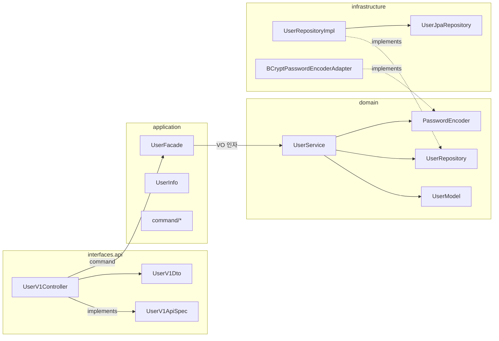

# migration: 유저 도메인 아키텍처 마이그레이션

## TL;DR

회원 도메인의 패키지·명명 규약을 Stayloop 의 표준 아키텍처(Example 패턴)에 맞춰 정렬했다. 도메인 레이어에 `UserService` 를 신설해 비즈니스 규칙을 끌어모으고, 애플리케이션 레이어의 `UserFacade` 는 트랜잭션 경계 + DTO 매핑만 책임지도록 책임을 분리했다. 컨트롤러는 `UserV1Controller` + `UserV1ApiSpec` 으로 OpenAPI 명세를 코드로 표현하고, 요청·응답 DTO 는 `UserV1Dto` 의 중첩 클래스로 통합했다. 인프라스트럭처는 `UserJpaRepository`(순수 Spring Data) + `UserRepositoryImpl`(@Component) 로 분리해 도메인이 Spring Data 에 직접 결합되지 않도록 했다. 테스트는 새 구조에 맞춰 도메인/애플리케이션/E2E 로 재배치했다.


## 무엇을 바꿨나 — 이전 vs 이후

| 위치 | 이전 | 이후 |
|---|---|---|
| 엔티티 | `domain/user/User.kt` | `domain/user/UserModel.kt` |
| 도메인 서비스 | (없음) | `domain/user/UserService.kt` (신규) |
| 애플리케이션 서비스 | `application/user/UserService.kt` (비즈니스 로직 직접 보유) | `application/user/UserFacade.kt` (도메인 서비스 위임) |
| 컨트롤러 | `interfaces/api/user/UserController.kt` | `interfaces/api/user/UserV1Controller.kt` + `UserV1ApiSpec.kt` |
| 요청·응답 DTO | `interfaces/api/user/dto/{SignUpRequest,ChangePasswordRequest,UserResponse}.kt` | `interfaces/api/user/UserV1Dto.kt` (중첩 `data class` 로 통합) |
| Repository (인프라) | `UserJpaRepository : UserRepository, JpaRepository<User, Long>` (다중 상속) | `UserJpaRepository : JpaRepository<UserModel, Long>` (순수) + `UserRepositoryImpl : UserRepository` (위임) |
| 테스트 | `UserTest`, `application/UserServiceTest`, `UserControllerTest` | `UserModelTest`, `domain/UserServiceTest`(신규), `application/UserFacadeTest`(신규), `UserV1ControllerTest` |


## 핵심 흐름 한눈에



의존성은 **항상 안쪽으로만 흐른다**. domain 은 application/infrastructure/interfaces 의 어떤 심볼도 import 하지 않는다.


## 고민과 선택

### 1. UserService 의 위치 — application 에서 domain 으로

이전 `application/user/UserService` 는 사실상 비즈니스 규칙(중복 검사, 인증, 비밀번호 교체)을 직접 들고 있었다. 이는 "애플리케이션 레이어는 유스케이스 조립 + 트랜잭션 경계 + 외부 표현 매핑" 에 그쳐야 한다는 원칙에 반한다.

대안 (A) 그대로 둠 / (B) 모두 `UserModel` 에 집어넣음 / **(C) `domain/user/UserService` 로 추출 + Facade 는 위임**.

(C) 선택. 엔티티 한 인스턴스로 표현되지 않는 협력(예: "동일 로그인 ID 가 이미 있는지" 는 Repository 와 협력 필요)은 도메인 서비스에 두는 것이 정통. 동시에 트랜잭션·DTO 매핑이라는 외부 관심사는 Facade 한 곳에만 있어 책임이 깨끗하다.

부수 결정: **도메인 서비스는 `application` 패키지를 import 하지 않는다.** `SignUpCommand` 는 application 의 입력 모델이므로, 도메인 서비스는 값 객체(`LoginId`, `Name`, `BirthDate`, `Email`, `PhoneNumber`)를 개별 파라미터로 받는다. Facade 가 Command → 값 객체 변환을 담당.


### 2. 컨트롤러를 인터페이스로 분리 — UserV1ApiSpec

대안 (A) 컨트롤러 클래스에 직접 `@Operation`/`@Tag` 부착 / **(B) `UserV1ApiSpec` 인터페이스 분리 + 구현**.

(B) 선택. OpenAPI 명세(스웨거 어노테이션)는 "API 계약" 의 표현이고, 구현(`@RestController` + 매핑) 과는 다른 관심사다. 인터페이스로 분리하면:

- 컨트롤러 본문이 어노테이션으로 부풀지 않음 (컨트롤러 = 라우팅/위임만)
- 계약 변경(요약/설명/태그)이 ApiSpec 에 모이고 PR diff 가 좁아짐
- 명세를 다른 구현체(예: 모킹용)와 공유 가능 (현재는 미활용이지만 비용이 크지 않음)


### 3. DTO 통합 — `UserV1Dto` 의 중첩 클래스

이전엔 `dto/SignUpRequest.kt`, `dto/ChangePasswordRequest.kt`, `dto/UserResponse.kt` 로 파일이 흩어져 있었다.

```kotlin
class UserV1Dto {
    data class SignUpRequest(...) { fun toCommand(): SignUpCommand = ... }
    data class ChangePasswordRequest(...) { fun toCommand(loginId: LoginId): ChangePasswordCommand = ... }
    data class UserResponse(...) { companion object { fun from(info: UserInfo): UserResponse = ... } }
}
```

도메인 별 DTO 가 한 파일에 모이면 IDE 에서 응답·요청 시그니처를 한 화면에서 비교 가능. 도메인이 작을 때(현재 회원만)는 파일 수 절감 효과가 크고, 커지더라도 `UserV1Dto`/`UserV2Dto` 단위로 분리하면 된다. 클래스 자체는 인스턴스화하지 않으므로 비용은 0.


### 4. Repository 분리 — JpaRepository 순수성 회복

이전: `UserJpaRepository : UserRepository, JpaRepository<User, Long>` 의 다중 상속 트릭. `JpaRepository.save(T): T` 가 `UserRepository.save(User): User` 와 시그니처 일치한다는 점을 이용한 우아한 한 줄짜리 구현이었지만:

- 도메인 인터페이스(`UserRepository`)가 인프라 패키지의 인터페이스(`JpaRepository`) 와 한 클래스에 묶임 → 도메인 패키지가 `JpaRepository` 를 의식하게 됨 (역방향 의존 위험)
- Spring Data 가 자동 생성하는 동작(예: `findByLoginId` 메서드 네이밍 쿼리)은 `JpaRepository` 의 영역인데, `UserRepository` 도메인 인터페이스에 그것이 노출됨

이번에 분리:
```kotlin
// domain (변경 없음)
interface UserRepository { fun save(user: UserModel): UserModel; ... }

// infrastructure
interface UserJpaRepository : JpaRepository<UserModel, Long> {
    fun findByLoginId(loginId: LoginId): UserModel?
    fun existsByLoginId(loginId: LoginId): Boolean
}

@Component
class UserRepositoryImpl(private val userJpaRepository: UserJpaRepository) : UserRepository {
    override fun save(user: UserModel) = userJpaRepository.save(user)
    override fun findByLoginId(loginId: LoginId) = userJpaRepository.findByLoginId(loginId)
    override fun existsByLoginId(loginId: LoginId) = userJpaRepository.existsByLoginId(loginId)
}
```

비용: 위임 메서드 3 줄 추가. 이득: 도메인이 Spring Data 를 모름, JpaRepository 메서드 네이밍 쿼리가 도메인 인터페이스에 새지 않음.


### 5. 엔티티 명명 — `User` → `UserModel`

Stayloop 의 다른 Aggregate 가 도입될 때(예: `Reservation`, `Room`) Example 패턴(`*Model`)을 따르는 것이 명시적이다. "User 라는 단어" 자체가 보안/세션/비즈니스 컨텍스트에서 다양하게 쓰이므로, 엔티티는 `UserModel` 이라는 분명한 접미사를 갖는 편이 호출 측에서 의도를 드러내기 쉽다.


### 6. 테스트 재배치

- `UserModelTest` (← `UserTest`): 엔티티 자체의 불변/상태 전이
- `domain/UserServiceTest` (신규): 도메인 서비스의 흐름 — 회원가입/인증/비밀번호 변경. `InMemoryUserRepository` + `FakePasswordEncoder` 를 직접 주입해 빠른 단위 테스트로 유지
- `application/UserFacadeTest` (신규): Command → 도메인 서비스 → Info 매핑이 끊김 없이 흐르는지. 도메인 서비스는 mock 하지 않고 실제 객체로 묶어 통합성 확보
- `UserV1ControllerTest` (← `UserControllerTest`): MockMvc + `MockkBean userFacade`. 인증 헤더 누락/검증 실패/CONFLICT/UNAUTHORIZED 매핑 회귀 가드


## 트레이드오프 정리

- 파일 수 증가: `UserService`(domain), `UserRepositoryImpl`(infra), `UserV1ApiSpec`(interfaces) 가 신설되어 6 개 파일이 늘었다. 응집도 분리의 명시적 비용으로 받아들임.
- 도메인 서비스가 `@Service` 어노테이션을 가짐: Spring stereotype 에 대한 약한 의존이 도메인에 들어왔다. 빈 등록 편의를 우선했고, 어노테이션 1 개 수준의 누출은 의존 방향 위반이라 보지 않음.
- 도메인 서비스가 값 객체 6 개를 개별 파라미터로 받음: Command 변환을 Facade 가 담당하느라 인자 수가 많다. 작은 helper 객체(예: `UserSignUpSpec`)를 도메인 안에 도입할 수도 있으나, 현재 사용처가 1 곳이라 과한 추상화로 판단해 미도입.
- `UserJpaRepository.findByLoginId`/`existsByLoginId` 가 메서드 네이밍 쿼리로 정의됨: 명시적인 `@Query` 가 더 안전하다는 의견이 있을 수 있으나, 단순 조회 1~2 개에 한해 Spring Data 의 표준 관용구를 따랐다.


## 리뷰 포인트

- `domain/user/UserService.kt` — `application` 패키지 import 가 한 줄도 없는지 (의존 방향 검수 1 순위)
- `application/user/UserFacade.kt` — `@Transactional` 이 이 클래스에만 있고, 도메인 서비스에 중첩 선언이 없는지
- `interfaces/api/user/UserV1Controller.kt` — `UserRepository`/`JpaRepository` 직접 주입이 없는지, 응답이 `UserModel` 이 아닌 `UserV1Dto.UserResponse` 인지
- `infrastructure/user/UserJpaRepository.kt` — 도메인 `UserRepository` 를 상속하지 않고 순수 `JpaRepository` 만 상속하는지
- `infrastructure/user/UserRepositoryImpl.kt` — 도메인 인터페이스를 구현하고 `@Component` 로 등록되어 빈 충돌이 없는지
- 테스트 — `UserFacadeTest` 가 도메인 서비스를 mock 하지 않고 실제 객체로 묶었는지, E2E 가 `userFacade` 만 mock 하는지
- 정책 게이트: `verify-architecture` (의존 방향/명명 규약/어노테이션 누출) 와 `verify-tests` (피라미드/더블/Gradle 통과) 통과 여부


## 게이트 결과

- `verify-architecture`: ✅ PASS (계층 의존 방향, Aggregate 패키지·명명, 어노테이션 누출, 멀티모듈 경계 모두 클린)
- `verify-tests`: ✅ PASS (`./gradlew ktlintCheck && test` BUILD SUCCESSFUL)
