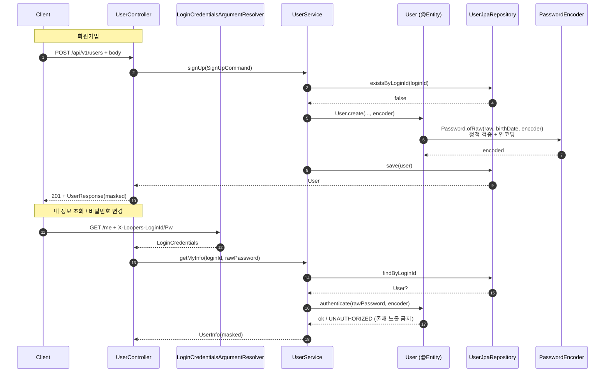

## TL;DR

`docs/presentation/week1-quests.md` 의 회원 도메인 요구사항(회원가입 / 내 정보 조회 / 비밀번호 수정)을 stayloop 의 첫 도메인으로 구현했다. 입력 검증을 도메인 VO 의 `init` 으로 끌어올리고, 평문 비밀번호가 객체 외부에 새지 않는 보안 게이트(`Password.ofRaw` + `private constructor`)를 세웠으며, 매 요청 헤더 인증을 `LoginCredentialsArgumentResolver` 로 모았다. 부수적으로 도메인을 JPA Entity 로 통합해 dirty checking 을 받을 자리를 마련했다.


## 무엇을 만들었나 — 요구사항 → 구현

| Round 1 요구사항 | 구현 |
|---|---|
| 회원가입: 6개 정보 형식 검증, 로그인 ID 중복 금지, 비밀번호 8~16자(영·숫·특 화이트리스트)·생년월일 미포함, 암호화 저장 | `POST /api/v1/users` → `UserService.signUp` → `User.create` (`Password.ofRaw` 보안 게이트). 동시성 race window 는 `ApiControllerAdvice` 가 `DataIntegrityViolationException` → `CONFLICT` 로 매핑 |
| 매 요청 `X-Loopers-LoginId` / `X-Loopers-LoginPw` 헤더 인증 | `LoginCredentialsArgumentResolver` — 컨트롤러 시그니처에 `credentials: LoginCredentials` 한 파라미터로 등장 |
| 내 정보 조회 + 이름 끝글자·휴대폰 가운데 마스킹 | `GET /api/v1/users/me` → `UserInfo(maskedName, maskedPhoneNumber, ...)` (마스킹은 VO 의 `masked()` 메서드) |
| 비밀번호 수정: 기존 비번 검증 + 정책 통과 + 동일 비번 거절 | `PATCH /api/v1/users/me/password` → `User.changePassword(currentRaw, newRaw, encoder)` |


## 핵심 변경 파일

- `domain/user/value/{Email,LoginId,Name,BirthDate,PhoneNumber,Password}.kt` — `@Embeddable` VO 6종, `init` 형식 검증, 마스킹·표현 메서드(`masked()`, `compact()`, `isoString()`)
- `domain/user/User.kt` — `@Entity` Rich Entity, `internal constructor` + `companion.create()` 보안 게이트, 모든 필드 `var ... protected set`, `authenticate` / `changePassword` 도메인 메서드
- `domain/user/PasswordEncoder.kt` + `infrastructure/user/BCryptPasswordEncoderAdapter.kt` — 도메인 인터페이스 / Spring Security BCrypt 어댑터 분리
- `domain/user/UserRepository.kt` + `infrastructure/user/UserJpaRepository.kt` — 다중 상속(`UserJpaRepository : UserRepository, JpaRepository<User, Long>`), 어댑터 클래스 없음
- `application/user/UserService.kt` + `command/{SignUpCommand,ChangePasswordCommand}.kt` + `UserInfo.kt` — 3개 유스케이스, 인증 헬퍼, "원본 + 마스킹" 양쪽 표현 보유
- `interfaces/api/auth/{LoginCredentials,LoginCredentialsArgumentResolver,WebMvcConfig}.kt` — 헤더 인증 리졸버
- `interfaces/api/user/UserController.kt` + `dto/{SignUpRequest,ChangePasswordRequest,UserResponse}.kt` — REST 표면, 검증 실패 매핑
- `interfaces/api/ApiControllerAdvice.kt` — `DataIntegrityViolationException` → `CONFLICT` 매핑 추가 (회원가입 동시성 race 방어)
- `support/test/{InMemoryUserRepository,FakePasswordEncoder}.kt` — 통합 테스트 더블
- `build.gradle.kts` / `settings.gradle.kts` — `kotlin-allopen` 적용 (`@Entity`/`@MappedSuperclass`/`@Embeddable` 자동 open)


## 핵심 흐름 한눈에




## 고민과 선택

요구사항 한 줄 한 줄을 풀면서 만난 결정들. 자세한 대안 비교는 `optional.md` 에 정리.

### 1. 입력 형식 검증을 어디에 둘 것인가

요구사항: 이메일·휴대폰·이름·생년월일·로그인 ID·비밀번호 형식 검증.

대안 (A) 컨트롤러 `@Valid` / (B) Service 분기 / **(C) 도메인 VO `init`**.

(C) 선택. **타입이 곧 계약** — `PhoneNumber` 인스턴스가 손에 있으면 `010-XXXX-XXXX` 형식이 보장됨. 다음 레이어가 다시 검증할 동기가 사라진다. 컨트롤러 / 서비스가 깨끗해지고, Bean Validation 어노테이션이 도메인에 들어오지 않는다.

부수 결정: `@JvmInline value class` 는 Hibernate 가 인식 못 함(JVM 인라인 → 사라짐) → `@Embeddable data class` 로. `kotlin-jpa` 가 합성 no-arg 생성자를 만들어주므로 `data class` 인 채로 동작. `init` 은 외부 입력에서만 실행되고 JPA 하이드레이션에선 실행되지 않아 "DB 정합성 신뢰 + 외부 검증" 비대칭이 자연스럽게 풀린다.


### 2. 평문 비밀번호가 클래스 외부에 새지 않으려면

요구사항: 비밀번호 암호화 저장 + 정책(8~16자, 영문·숫자·특수문자만 허용, 생년월일 포함 금지).

```kotlin
@Embeddable
class Password private constructor(
    @Column(...) val encoded: String,
) {
    override fun toString(): String = "Password(encoded=***)"
    companion object {
        fun ofRaw(raw: String, birthDate: BirthDate, encoder: PasswordEncoder): Password {
            // 정책 검증 → 인코딩 → Password 인스턴스
        }
    }
}
```

- **`private constructor` + 단일 진입점 `ofRaw`** — 외부에서 `Password(...)` 직접 생성 불가. `ofEncoded` 같은 우회 팩토리는 두지 않음(공개되어 있으면 호출자가 평문을 그대로 감싸 정책 게이트를 우회할 수 있음). DB 에서 읽어들이는 경로는 JPA 의 리플렉션 하이드레이션이 처리.
- **`ofRaw` 정적 팩토리** — 평문은 호출 스택 안에서만 살다 사라지고, `Password` 의 필드는 항상 인코딩 결과
- **`toString = "***"`** — 로그/직렬화에 평문 흔적 안 남음
- **`PasswordEncoder` 도메인 인터페이스 + `BCryptPasswordEncoderAdapter`** — Spring Security 의존이 도메인에 새지 않음

> 정책 해석 노트 — week1-quests 원문 *"8~16자의 영문 대소문자, 숫자, 특수문자만 가능합니다"* 는 **허용되는 문자 집합의 화이트리스트**로 읽었다. 즉 `Abcd1234` (특수문자 없음) 도 통과한다 — 셋 다 포함하라는 뜻이 아니다. 정규식도 `^[A-Za-z0-9!@#...]{8,16}$` 한 덩어리이지, "각 카테고리 최소 1개" lookahead 가 아니다.

`Password` 만 다른 VO 들과 다르게 `data class` 가 아니라 수동 클래스 — 데이터 클래스의 자동 `toString` 이 평문/인코딩 값을 노출할 위험을 차단하기 위함. 일관성을 깨고서라도 "비밀번호는 다른 VO 와 다르다" 는 메시지를 코드 형태로 남겼다.


### 3. "비밀번호에 생년월일 금지" 같은 교차 검증의 위치

`Password` 가 자체 raw 만으로는 정책을 다 검증하지 못한다 — `BirthDate` 를 알아야 한다.

대안 (A) `User.create` 에서 검증 → 정책이 분산 / (B) 도메인 서비스 분리 → 과한 추상화 / **(C) `Password.ofRaw(raw, birthDate, encoder)` 시그니처에 명시**.

(C) 선택. **정책의 응집도가 클래스 결합도보다 가치가 높다.** "비밀번호에 무엇이 들어가면 안 되는가" 는 `Password` 가 책임진다. `BirthDate → Password` 단방향 의존, 순환 없음. 호출자 입장에서 시그니처가 곧 문서.

부수: `BirthDate` 가 두 표현을 갖게 됐다 — `isoString()` (응답용 `2000-01-01`) / `compact()` (검사용 `20000101`). VO 가 자기 표현 변환을 직접 갖는 패턴을 일찍 굳혔다. `Name.masked()`, `PhoneNumber.masked()` 도 같은 결.


### 4. 헤더 인증을 컨트롤러마다 반복하지 않으려면

요구사항: 매 요청 `X-Loopers-LoginId` / `X-Loopers-LoginPw` 로 인증.

대안 (A) `@RequestHeader` 두 개 / (B) Filter + SecurityContext (Spring Security 의존) / (C) Interceptor / **(D) `HandlerMethodArgumentResolver`**.

(D) 선택.

```kotlin
@GetMapping("/me")
fun getMyInfo(credentials: LoginCredentials) = ...
```

- 컨트롤러 시그니처가 의도를 표현 — "이 엔드포인트는 인증 필요" 가 한눈에
- Spring Security 를 끌어들이지 않음 (Round 1 은 매 요청 평문 비번 헤더라는 단순 모델 — Security 는 과한 도구)
- 헤더 누락 처리(UNAUTHORIZED) 가 한 곳(`resolveArgument`) 에 집중
- 헤더 누락 = `UNAUTHORIZED`, 헤더 형식 오류(`LoginId` 영·숫자 4~20자 위반) = `BAD_REQUEST` 자연 분리


### 5. 마스킹은 누구의 책임인가

요구사항: 이름 끝글자, 휴대폰 가운데 마스킹.

```kotlin
@Embeddable data class Name(val value: String) { fun masked() = ... }
@Embeddable data class PhoneNumber(val value: String) { fun masked() = ... }

data class UserInfo(
    val loginId: String, val maskedName: String, val birthDate: String,
    val email: String, val maskedPhoneNumber: String,
)
```

VO 에 `masked()` 두기 vs 응답 DTO 에서 가공.

VO 에 둠 — "이름의 마지막 글자를 마스킹한다" 는 규칙은 `Name` 의 본질적 표현. `UserInfo` 는 "이번 응답에 어떤 표현을 쓸지" 만 결정 (이름·휴대폰은 마스킹된 값, 이메일·생년월일은 원본). 표현 계층 `UserResponse` 는 단순 매핑만.

`UserInfo.maskedName` 같은 필드명을 명시적으로 둔 이유: 호출자가 풀네임이라고 헷갈릴 여지를 변수명에서부터 차단.


### 6. "없는 사용자" vs "비밀번호 틀림" 응답 구분

(i) `loginId` 자체가 없음 → ? (ii) 비밀번호 틀림 → 401

(i) 을 NotFound 로 하면 **계정 enumeration** 가능. → 둘 다 `UNAUTHORIZED`, 메시지도 동일하게 *"로그인 ID 또는 비밀번호가 일치하지 않습니다."*

`UserServiceTest.shouldReturnUnauthorized_whenUserNotFound` 가 이 결정을 회귀 가드로 박아둔다 — 테스트 이름의 *(존재 노출 금지)* 가 의도의 흔적.


### 7. User 객체의 안전한 생성 진입점

`User(loginId, password, ...)` 가 외부에 열려 있으면 보안 게이트(`Password.ofRaw`) 우회 가능.

대안 (A) `protected` — final 클래스에선 사실상 private (IDE *protected visibility is effectively private*) / (B) `private` — 테스트 friction / **(C) `internal constructor` + `companion.create()`** / (D) `public` — 향후 자매 모듈에서 우회 가능.

(C) 선택. "이 모듈(`apps/stay-api`) 내부 production·test 만 허용, 다른 모듈은 차단". 향후 `stay-batch` / `stay-admin` 이 생겨도 그쪽에선 반드시 `create()` 통과.


### 8. 필드 가변성 — `var ... protected set` 본문 선언

회원 도메인엔 `changeEmail`/`changePhoneNumber`/`changeName` 추가가 거의 확실. `val` 디폴트 → 매번 리팩토링 누적.

```kotlin
class User internal constructor(
    loginId: LoginId, ...                    // 그냥 파라미터
) : BaseEntity() {
    @Embedded var loginId: LoginId = loginId
        protected set
    ...
}
```

"외부 read-only / 내부 mutable" 일관. 코틀린은 주 ctor 의 `var` 에 `protected set` 직접 못 붙임 → **본문 선언이 setter 가시성 제어의 유일한 경로**. 비용은 필드당 3→6줄, 캡슐화 대가로 받아들였다.


### 9. 영속 모델 — 도메인/JPA 통합과 어댑터 제거

VO 를 `@Embeddable` 로 만들고 보니 어댑터(`UserRepositoryAdapter`) 가 dirty checking 을 흉내내는 코드를 갖기 시작.

```kotlin
// 어댑터 — JPA 본연의 기능을 위장
override fun save(user: User): User =
    if (user.id == 0L) jpa.save(fromDomain(user)).toDomain()
    else jpa.findById(user.id).get().apply { password = user.password }.let { jpa.save(it).toDomain() }
```

→ User = `@Entity` 통합, 어댑터·`UserJpaEntity`·`reconstruct` 삭제, 인터페이스 다중 상속으로 흡수.

```kotlin
interface UserJpaRepository : UserRepository, JpaRepository<User, Long>
```

`JpaRepository.save(T): T` 가 `UserRepository.save(User): User` 와 시그니처 일치 → 한 메서드가 두 계약 동시 만족. Spring Data 가 자동 빈 등록. `@Component` 어댑터, 별도 클래스 모두 불필요.

부수: `kotlin-allopen` 으로 `@Entity`/`@MappedSuperclass`/`@Embeddable` 자동 open — `protected set` 이 의미를 갖고 Hibernate 의 lazy 프록시 동작 준비.

받아들인 비용: 도메인 패키지에 `jakarta.persistence.*` 침투(헥사고날 순수성 양보), `InMemoryUserRepository` 가 `BaseEntity.id` 를 리플렉션으로 할당(JPA id 자동 할당 흉내).


## 트레이드오프 정리

- 도메인이 `jakarta.persistence.*` 에 의존 — NoSQL 이전 시나리오 부재, JPA 친화적 모델링 우선
- `InMemoryUserRepository` 의 리플렉션 — JPA id 자동 할당 동작 자체가 리플렉션 기반, fake 한 곳에 격리
- 필드당 6줄(`var x = x` + `protected set`) — "외부 read-only / 내부 mutable" 일관성 확보
- `User.changePassword(currentRaw, newRaw, ...)` 시그니처에 평문 String 통과 — `Password` 인스턴스로 감싸려면 정책 검증 필요한데 `currentRaw` 는 매칭만 함, 인스턴스화 강제는 과한 추상화
- `getMyInfo` 가 NotFound 와 비밀번호 불일치를 같은 응답으로 — 계정 enumeration 차단을 위한 의도적 모호함
- 회원가입 동시성 — `existsByLoginId` 사전조회와 DB unique constraint 의 race window 가 있다. `ApiControllerAdvice` 가 `DataIntegrityViolationException` → `CONFLICT` 로 매핑해 5xx 가 아닌 409 로 응답하도록 방어. 더 정밀하게는 constraint name 별 분기가 가능하지만 현재 unique 가 하나뿐이라 일반 매핑으로 충분.


## 리뷰 포인트

- `domain/user/value/Password.kt` — `private constructor` + `ofRaw` 가 유일 진입점인지(우회 팩토리 없는지), `toString`/`equals` 가 평문 노출을 차단하는지
- `domain/user/User.kt` — `internal constructor` + `companion.create()` 가 유일 진입점인지, 평문 비밀번호가 클래스 외부에 노출될 경로가 없는지
- `application/user/UserService.kt` — `getMyInfo` / `changePassword` 가 존재하지 않는 사용자에게도 `UNAUTHORIZED` 로 응답하는지 (계정 enumeration 차단)
- `interfaces/api/auth/LoginCredentialsArgumentResolver.kt` — 헤더 누락 = `UNAUTHORIZED` / 헤더 형식 오류 = `BAD_REQUEST` 분기가 정확한지
- `interfaces/api/ApiControllerAdvice.kt` — `DataIntegrityViolationException` 핸들러가 동시성 race window 를 409 로 잘 옮기는지
- `infrastructure/user/UserJpaRepository.kt` — `JpaRepository.save(T): T` 가 `UserRepository.save(User): User` 계약을 만족시키는 다중 상속 트릭
- `support/test/InMemoryUserRepository.kt` — 리플렉션 id 할당이 fake 에만 갇혀 있는지 (프로덕션 누수 없음)
- 테스트 더블의 역할 분리: `FakePasswordEncoder` 는 흐름만, `Password` 단위 테스트가 정책 검증 — 이 분담이 깨지지 않았는지
