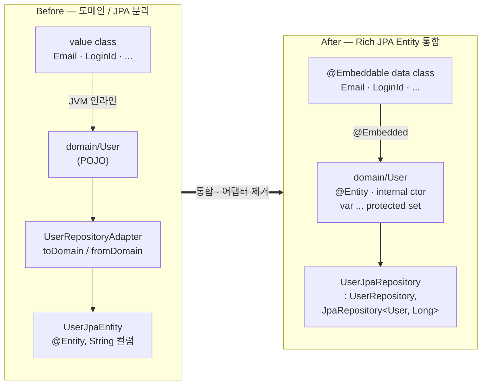
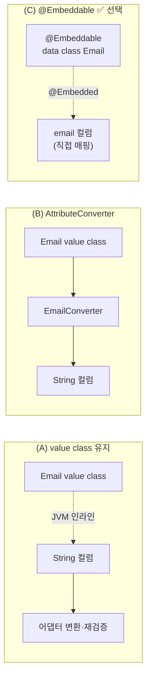
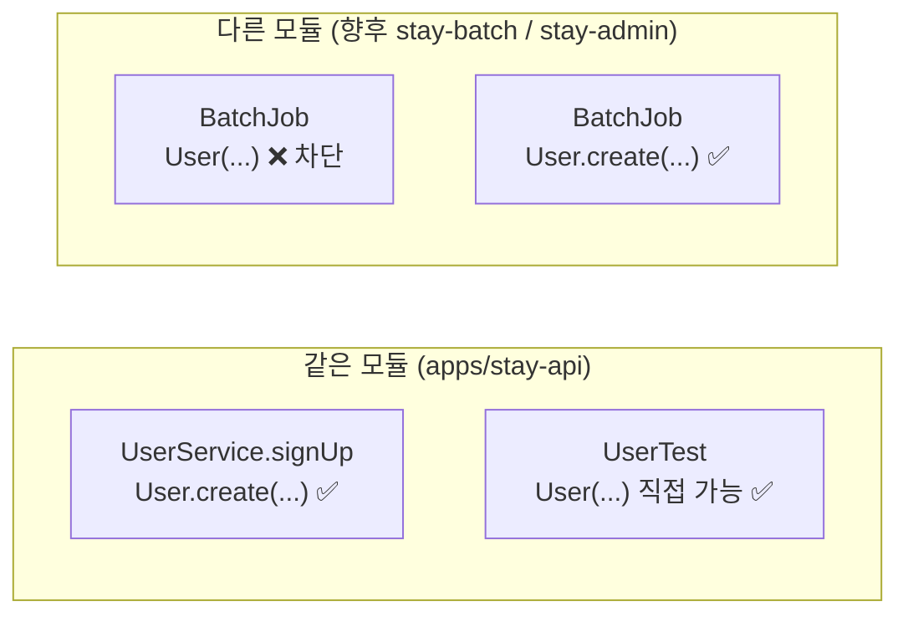
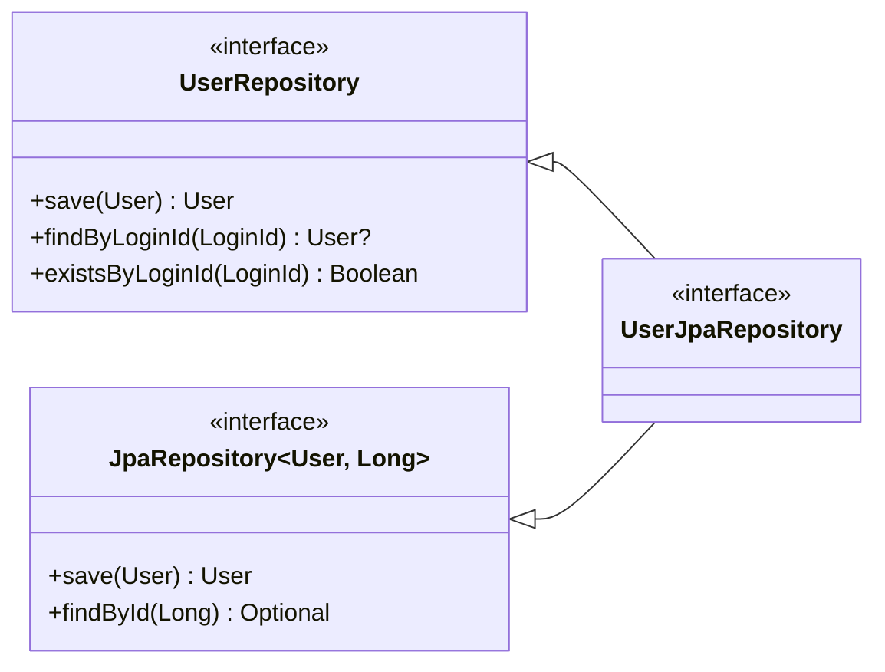

## TL;DR

회원(User) 도메인을 JPA Entity로 통합. 값 객체 6종을 `@Embeddable`로 끌어올리고 도메인/JPA 분리 어댑터를 제거해 dirty checking·lazy loading 등 JPA 본연의 기능을 받을 자리를 마련했다.


## 구조 변경 한눈에



| 구성요소 | Before | After |
|---|---|---|
| 값 객체 | `@JvmInline value class` (JPA 비가시) | `@Embeddable data class` (직접 매핑) |
| 도메인 객체 | `domain/User` (POJO) | `domain/User = @Entity` |
| 영속 매핑 | 별도 `UserJpaEntity` + 어댑터 변환 | 동일 클래스, 어댑터 삭제 |
| 리포지토리 | `UserRepositoryAdapter` 위임 | `UserJpaRepository`가 두 인터페이스 동시 만족 |
| 변경 트리거 | `save()` 명시 호출 | 매니지드 엔티티 dirty checking |


## 핵심 변경

- `domain/user/value/*.kt` (Email, LoginId, Name, BirthDate, PhoneNumber, Password) — `@JvmInline value class` → `@Embeddable data class`. `@Column` 메타데이터는 임베디드의 `value` 필드에 부착
- `domain/user/User.kt` — 순수 도메인 → `@Entity` Rich Entity. `internal constructor` + `companion.create()` 보안 게이트, 모든 필드 `var ... protected set` 본문 선언
- `infrastructure/user/UserJpaEntity.kt`, `UserRepositoryAdapter.kt` — 삭제
- `domain/user/UserRepository.kt` + `infrastructure/user/UserJpaRepository.kt` — 다중 상속(`UserJpaRepository : UserRepository, JpaRepository<User, Long>`)으로 어댑터 흡수
- `User.reconstruct()` — 제거. `InMemoryUserRepository`는 `BaseEntity.id`를 리플렉션으로 할당
- `build.gradle.kts` / `settings.gradle.kts` — `kotlin-allopen` 적용 (`@Entity`, `@MappedSuperclass`, `@Embeddable` 자동 open)


## 결정과 대안

### 1. 값 객체: `@JvmInline value class` → `@Embeddable data class`

`Email`/`LoginId` 같은 값 객체를 `@JvmInline value class`로 두면 JPA가 보지 못한다. JVM 레벨에서 `String`으로 인라인되어 사라지기 때문이다. 기존 구조는 `UserJpaEntity`가 `String email`을 들고 어댑터에서 `Email`로 변환하면서, `Email.init`의 정규식 검증이 영속 경계를 통과할 때마다 재실행되는 비대칭이 있었다.



value class는 JPA 필드로 사용 불가능 — 사실상 (C)가 유일한 선택. AttributeConverter는 컨버터 N개 + 다중 필드 임베디드(`Money(amount, currency)` 같은) 한계. `kotlin-jpa` 플러그인이 `@Embeddable`에 합성 no-arg 생성자를 만들어주므로 `data class`로 둬도 동작한다. `init` 블록이 하이드레이션 시엔 실행되지 않아 DB 정합성 신뢰 + 외부 입력만 검증하는 구조가 자연스럽다.

### 2. User = `@Entity` 통합, 어댑터 제거

값 객체만 `@Embeddable`로 바꾼 직후의 어댑터에는 dirty checking을 흉내내는 `apply { password = user.password }` 같은 코드가 남았다. JPA의 핵심 기능을 어댑터에서 흉내내는 것은 위장된 보일러플레이트다.

대안은 (A) 도메인/JPA 완전 분리 유지 / (B) `User = @Entity`이지만 어댑터 유지 / **(C) `User = @Entity` + 어댑터 제거**. (A)는 dirty checking을 못 살리고 `toDomain/fromDomain` 변환을 영구히 짊어진다. (B)는 (C)에서 `UserJpaRepository`가 두 인터페이스를 동시에 만족시킬 수 있다는 사실을 깨닫는 순간 의미가 사라진다 (§6 참조). 결과 구조는 위 "구조 변경 한눈에"에서 시각화.

### 3. 생성자 가시성: `internal constructor`

`User.create()`는 단순 편의 팩토리가 아니라 비밀번호 정책 검증과 인코딩(`Password.ofRaw`)을 강제로 통과시키는 **보안 게이트**다. 반드시 거쳐야 한다.



- `protected`: final 클래스에선 사실상 `private`와 동일 (IDE 정확 지적: *protected visibility is effectively private in a final class*)
- `private`: 테스트에서도 `User(...)` 직접 생성 불가 → 인코더 fake를 매번 통과해야 하는 비용
- `public`: 향후 자매 모듈에서 보안 게이트 우회 가능
- **`internal`**: "이 모듈 내부 — 같은 모듈의 production·test는 허용, 다른 모듈은 차단"을 정확히 표현

### 4. 필드 가변성: 모두 `var ... protected set` (본문 선언)

`val` 디폴트는 좋지만 회원 도메인엔 `changeEmail`/`changePhoneNumber`/`changeName` 추가가 거의 확실하다. 그때마다 `val → var` 풀어내는 리팩토링이 누적될 바엔, 처음부터 일관되게 `var ... protected set`으로 두는 편이 낫다 (참조 프로젝트의 `Brand`/`Product`/`Order` 동일 관용).

본문 선언인 이유는 단순 — **코틀린은 주 생성자의 `var`에 `protected set`을 직접 못 붙인다.** 본문 선언이 setter 가시성 제어의 유일한 경로다. 비용은 필드당 3→6줄, 캡슐화의 대가로 받아들였다. 핵심은 "외부 read-only / 내부 mutable" — `user.email`은 읽기 가능, `user.email = newEmail`은 외부에서 컴파일 에러, 클래스 내부의 `changeEmail()`만 setter 호출 가능.

### 5. 클래스 open화: `kotlin-allopen` 플러그인

코틀린 클래스는 기본 `final` → `protected set`이 IDE에서 *effectively private* 경고로 떴다. 동시에 Hibernate의 lazy 프록시(CGLIB / ByteBuddy 동적 서브클래스)가 동작하려면 클래스가 `open`이어야 한다.

대안 비교:
- 무시: 향후 lazy 연관관계 도입 시 깨짐
- 클래스마다 `open` 키워드: 누락 위험, N번 반복 — 안티패턴
- **`kotlin-allopen` + 어노테이션 지정**: 빌드 설정 1회로 일관성 자동 보장

흔히 헷갈리는데 `kotlin-spring`은 Spring 스테레오타입(`@Component`/`@Transactional`)만, `kotlin-jpa`는 no-arg 생성자만 처리한다 — `@Entity`/`@Embeddable`을 자동 open 해주지 않는다. allopen은 별개로 필요.

### 6. 리포지토리: 어댑터 → 다중 상속



`JpaRepository.save(T): T`가 `UserRepository.save(User): User`와 시그니처가 일치하므로 **한 메서드가 두 계약을 동시에 만족**한다. Spring Data가 빈을 자동 등록 → `@Component` 어댑터, 별도 클래스 모두 불필요.

대안은 참조 프로젝트의 정석 `XxxRepositoryImpl` 어댑터다. 이번 도메인엔 위장된 위임 — `save`/`findByLoginId`/`existsByLoginId`만 있어 Spring Data 메서드 네이밍 규칙으로 충분히 표현된다. 향후 `getActive(loginId): User`(NotFound throw) 같은 의미적 메서드, 또는 캐싱·로깅 같은 횡단 관심사가 생기면 그 시점에 어댑터 패턴으로 이행한다.

### 7. 컬럼 메타데이터 위치: 임베디드 `value` 필드에 `@Column`

```kotlin
@Embeddable
data class Email(
    @Column(name = "email", nullable = false, length = 100)
    val value: String,
)
```

대안은 엔티티 측 `@Embedded` 필드에 `@AttributeOverride`. 후자는 같은 임베디드를 한 엔티티에 여러 번 박을 때만 의미가 있는데(예: 송·수신 `Address`), User엔 그런 케이스가 없다. 컬럼명·길이는 값 객체의 본질 속성이므로 값 객체 내부에 두는 편이 응집도가 높다.


## 트레이드오프

- 도메인 패키지에 `jakarta.persistence.*` 침투 — 헥사고날 순수성 양보. 프로젝트 규모와 NoSQL 이전 시나리오 부재로 합리적 비용
- `InMemoryUserRepository`가 리플렉션으로 `BaseEntity.id`를 할당 — JPA id 자동 할당을 흉내내는 행위 자체가 리플렉션 기반. 프로덕션엔 새지 않고 fake에 격리
- 필드당 6줄(`var x = x \n protected set`) — 캡슐화 대가. "외부 read-only / 내부 mutable" 일관성 확보


## 리뷰 포인트

- `domain/user/User.kt` — `internal constructor` + `companion.create()` 가 유일 진입점인지, 평문 비밀번호가 클래스 외부에 노출될 경로가 없는지
- `infrastructure/user/UserJpaRepository.kt` — `JpaRepository.save(T): T` 가 `UserRepository.save(User): User` 계약을 만족시키는 다중 상속 트릭
- `support/test/InMemoryUserRepository` — 리플렉션 id 할당이 fake에만 갇혀 있는지 (프로덕션 누수 없음)
